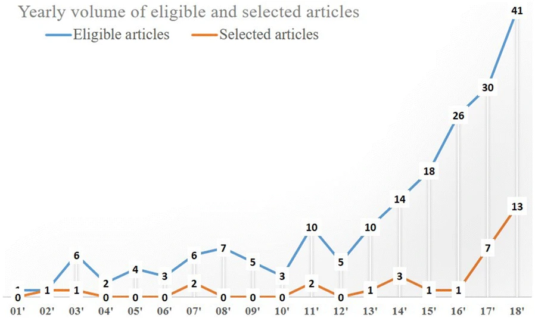

```{r setup, include=FALSE}
library(knitr)
# ---------------------------------
knitr::opts_chunk$set(echo = FALSE, message=FALSE, warning=FALSE)

```

```{r libraries, include=TRUE}

# Your libraries go here

library(tidyverse) 
library(ggplot2) 
library(ggrepel)
library(kableExtra) 
library(dplyr)

library(caret)   # Model Framework
library(skimr)    # Used for EDA
library(klaR)     # Implemented KNN and Naive Bayes models, etc

# PLEASE ADD YOUR R LIBRARIES BELOW
# ------------------------------
# Alex dependencies
library(janitor)  # used for tabyl function
library(sf)     # used for spatial data load and calculations
library(tmap)   # used for plotting maps
library(spdep)

# Phil dependencies
library(tidymodels)
library(cluster)
library(factoextra)
library(ggmap)
library(gridExtra)

# Scott dependencies
library(FactoMineR)
library(factoextra)
library(fastDummies)

# Randy dependencies
library(GGally)


```


```{r control-slow-code}
# Alex:
# This code chunk is only to be used for conditionally disabling certain
# very slow model code as I merge different sections and need to frequent recompile
runSlowChunks = F

```

# Introduction {-}

The machine learning research literature on crime prediction and analysis has grown steadily in the last two decades [Kounadi, Ristea, et. al.(2020)](https://doi.org/10.1186/s40163-020-00116-7).  This document analyzes municipal crime data from 2018-2020 for the Town of Cary, North Carolina using both supervised and unsupervised machine learning methods.   We examine patterns in crime incidents by residential subdivision.
Our work follows that literature in its type of data, visualization and quantitative methods.  It differs from the literature
in choosing a lesser known town instead of a metropolitan area and in its use of residential subdivisions instead of square grids or entire cities or counties.   We argue that both medium sized towns and residential subdivisions are fruitful entities on which to apply machine learning crime analysis.

**Section 1** describes the background and data sources.

**Section 2** shows data visualization and exploratory data analysis.

**Section 3** applies a k-means clustering algorithm to identify crime hot spots

**Section 4** examines principal component analysis of the crime data

**Section 5** examines spatial regression models to predict crime rates using the 2018 training and 2019 test split.

**Section 6** concludes our remarks.

**Section 7** presents our `R` code and technical appendices and references.  

Section 1 and 5 were prepared by Alexander Ng.   Section 2 by Randy Thompson.   Sections 3 was prepared by Philip Tanofsky.   Section 4 was prepared by Scott Reed.   Section 6 was joint work.

# Background and Data Sources

## Background

*Tobler's first law of geography:  "everything is related to everything else, but near things are more related than distant things"  [Grekousis, p11](https://www.researchgate.net/publication/341523817_Spatial_Analysis_Methods_and_Practice_Describe_-_Explore_-_Explain_through_GIS/citation/download)*

We investigate crime in the Town of Cary in Wake County, North Carolina.   This is a relatively  prosperous middle sized boom town located in the Research Triangle area of North Carolina where technology and health companies are concentrated. The Town of Cary has an open data initiative.   On the Town's [website](), the Police Department publishes crime incident data compiled by its Police Department, residential subdivision boundary data and town boundaries.   Most machine learning studies focus on larger metropolitan areas such as San Francisco, Chicago or New York. [Kaggle, 2015](https://www.kaggle.com/c/sf-crime), [Dash, et.al. 2018](https://arxiv.org/abs/1808.06241),  [Chohlas-Wood, Levine, (2019)](https://doi.org/10.1287/inte.2019.0985)   To our knowledge, this is the first machine learning study of crime in Cary, North Carolina.

The research literature on machine learning methods to analyze crime data is large.
A recent literature survey [Kounadi, Ristea, et. al, 2020](https://doi.org/10.1186/s40163-020-00116-7) found 786 papers in spatial crime forecasting. A chart below of the better quality papers for that survey is shown below.


[Kounadi, Ristea, et. al.(2020)](https://doi.org/10.1186/s40163-020-00116-7)

Most papers used geographic grids or broader regions like districts, cities or counties.  In this study, we use residential subdivisions.   Residents in Cary typically live in residential subdivisions.   These subdivisions are overseen by homeowner associations (HOA) but are not municipal administrative units.   Such subdivisions are often built on farmland or previously vacant land lacking basic utilities like water, sewage or power prior to the development. Rather residential subdivisions can be planned communities constructed by real estate development firms to be sold to homeowners.   One of the top 32 papers used residential communities as spatial unit of measure [Dash, et.al. 2018](https://arxiv.org/abs/1808.06241) in Chicago.   However, the Chicago communities are defined as rectangles in a grid pattern in Chicago by Chicago's tourism bureau based on survey responses.   They are even less structured than residential subdivisions.

One challenge of using residential subdivisions is their heterogeneity of purposes and population and geographic dispersion.   A benefit of using residential subdivisions is that they are actual communities - often defined by a homeowner association with like-minded residents.

Our focus is to leverage this rich literature on data sources and entities which have been unexplored or less explored.   Hence we focus on using standard methods on less well known cities and on less commonly used geographic units (residential subdivisions).


## Data Sources

The data sources consists of 4 data files containing typical numerical and qualitative data and geospatial data.

* Town of Cary Boundary File:  `cary_boundary.geojson` which contains the geographic border information of the town.  

* Census Income Data:   We used the American Community Survey (ACS) dataset for 2018 median household income on census tracts overlapping with the Town of Cary.   

* Residential Subdivisions:   We use the file:  `httpmapstownofcary0.geojson` obtained from the Town of Cary Open data portal to identify approximately 700 residential subdivisions within the Town.   These correspond to neighborhoods of the Town.

* Crime Incident Data from the Cary Police Department:   We use the historical crime from the Town of Cary Police Department as of Nov 30, 2020.   This file contains all historical crime incidents with geospatial data, date, crime category information.   We will use the crime incident data from 2018 to 2020.


First we load the relatively small files containing town and residential subdivision and household income data.

```{r geojson-load}

# Load the raw data for the town boundary
town_raw = sf::st_read("cary_boundary.geojson", quiet = TRUE)

# Load the raw data for the census
acs_raw = sf::st_read("acs2018_5yr_B19013_14000US37183053513.geojson", quiet = TRUE)

# Load the subdivisions
div_raw = sf::st_read("httpmapstownofcary0.geojson", quiet = TRUE)


```

Then we load the crime incident data.   The raw dataset is quite large and requires some effort to import.

```{r crime-rawdata-load}

cpd_raw = sf::st_read("cpd-incidents.geojson", quiet = TRUE)
```

After importing all the raw files, we can examine their dimensions and contents below:

```{r raw-dataset-size}
dataset_sizes = data.frame( town_limits = as.character( dim(town_raw) ) ,
                            acs_income  = as.character( dim(acs_raw) ) ,
                            subdivisions = as.character( dim(div_raw) ),
                            crimes       = as.character( dim(cpd_raw) ) )

dataset_sizes = rbind( dataset_sizes, c("Town of Cary", "Censusreporter.org", "Town of Cary", "Town of Cary Police Department"))
row.names(dataset_sizes) = c("number rows", "number columns", "source")


dataset_sizes %>% kable( caption = "Raw data file dimensions" ) %>% kable_styling(bootstrap_options = c("striped", "hover"))
```


## Data Issues and How We Address Them

To conduct this analysis, we had to address both the usual missing or bad data issues but also geospatial and methodological issues.   We review each data source and discuss both types of issues jointly.


### Town Boundaries

The Town of Cary straddles two counties and a significant part of the Town is zoned for commercial or business purposes.  However, we determined that the residential subdivisions lie inside the Town thus avoiding the complex issue where subdivisions are split across two municipalities.  This dataset provided in `GeoJson` format is mainly a control during exploratory data analysis.   We rely on the residential subdivisions rather than the town boundary datafile to conduct our statistical learning analyses.

```{r town-adjust}
#
# Use the North Carolina NAD83 Projected CRS
# --------------------------------------------------
town = st_transform(town_raw, 2264)

```


### Residential Subdivisions


We found and removed 4 subdivisions out of 717 where geometry data is missing.   We added an identity column `div_id` to serve as a primary key because subdivision names did not appear to be unique.   

```{r load-div-raw}
# Remove any observations (subdivisions) where geometry data is missing.
#
div = div_raw %>% filter(  !is.na(st_dimension(div_raw) ) )

print(paste0("raw subdivisions data: ",  nrow(div_raw), " vs. ", "tidied subdivisions data: ", nrow(div)))

# Add an integer identifier to the subdivisions dataframe as there is no unique key (except geometry)
div = tibble::rowid_to_column(div, "div_id")

# Change the CRS coordinate system from WGS84 to NAD83/North Carolina
# in order to allow distance measurement, etc.
div = st_transform(div, 2264)

```

### Census Tract Level Household Income


Next, we obtained all census tracts covering the Town of Cary limits.   It was necessary to construct a dataset with 47 census tracts to cover the Town of Cary limits.   However, census tracts don't generally align with residential subdivisions.  Therefore, multiple census tracts may partition a residential subdivision.   The data was obtained from the non-profit censusreporter.org website as a Geojson file.   There was no missing data but the median household income data element was renamed from the obscure `B19013001` to `income` for clarity.   The data comes from the 2018 ACS dataset.   We display some representative rows below while simplifying the dataset further.

Lastly, the table below shows the median household income in dollars within each census tract based on the ACS 2018 Survey.

```{r acs-crs}

# Change the coordinate system for the ACS survey data to EPSG 2264 North Carolina ft-US
acs = st_transform(acs_raw, 2264)

acs = acs %>% rename(tract_name = name ) %>% 
  rename( income = B19013001 ) %>%  dplyr::select( -one_of(c("B19013001..Error") ) )

head(acs, 5) %>% kable() %>% kable_styling(bootstrap_options = c("striped", "hover"))
```

Because our goal is to estimate median household income of a residential subdivision using census tract data, the non-alignment of these two geographical datasets poses a challenge.   We estimate the median household income $f(S)$ for a residential subdivision $S$ by taking a weighted average of the median household income of all census tracts $c$ that intersect a given residential subdivision.   More formally, we define:

$$ f(S) = \sum_{ c \cap S \neq \emptyset }  \frac{\mu(c \cap S) }{\mu(S)} \text{Income}(c) $$
where $\mu(A)$ is the area of a region $A$.
 
To construct this weighted average requires geospatial intersections and dataframe joins which we do using
the `sf` geospatial library and `tidyverse` for typical dataframe operations.

We observe that about 6% of all subdivisions 43 out of 713 belong to more than one census tract.  Of those, only 4 belong to 3 census tracts.  Moreover, the median household income range across the census tracts is not extreme.   

```{r acs-income-range}
summary(acs$income)
```

The lowest income is \$48,314 while the highest is \$169,600 with a median of $109,628.


```{r acs-intersection}
#  Calculation all the intersections between census tracts and
#  residential subdivisions
#
div_acs_partition = st_intersection( div, acs)

dim(div_acs_partition)
```

We compute the weighted average income below and then save its value back to the residential subdivision dataset.   Sample rows are illustrated below.

```{r area-weighting}
df_div_acs_areas = data.frame( area = as.numeric( st_area(div_acs_partition) ), 
                               tract_name = div_acs_partition$tract_name ,
                               name = div_acs_partition$name,
                               div_id = div_acs_partition$div_id, 
                               income = div_acs_partition$income ) 
df_div_acs_areas %>% group_by(div_id) %>%
                   summarize(avg_income = weighted.mean(income, area) ,
                             count = n(),
                             max_id = max(div_id) 
                             ) -> div_avg_income

div %>% dplyr::left_join( div_avg_income, by = 'div_id') %>% 
  dplyr::select( div_id, category, name, 
                  shape_stlength, shape_starea, approvedlots, description, geo_point_2d, 
                 avg_income, geo_point_2d) -> div

head(div, n = 3 ) %>% kable() %>% kable_styling(bootstrap_options = c("striped", "hover") )

```


### Crime Incidents 

Crime incident data is a large historical dataset.  The raw data file, obtained in Dec 2020, contains crime incident data from 1977 to 2020.   We have decided to use only the most recent years (2018-2020).

This time limitation still produces a large number of observations (over 13000) but avoids two problems.
One is the data quality issues arising from inconsistent reporting especially during its early years. The second, equally important, is that the Town has grown rapidly from the early 2000s.  New residential subdivisions have sprouted up over the last two decades.   Thus, the absence of crime in a residential subdivision could mean that it was not yet built.   Unfortunately, we don't have historical data on the creation of residential subdivisions.  So we are restricted to doing a point-in-time study.

We also filter the incidents by data quality.   A significant number of crime incidents lack geometry data which means we cannot find the location within a subdivision.   We purge those observations but they are less than half.  In recent years, we find geospatial data to be quite completely.

Lastly, we restrict the crime dataset to those incidents occuring in the residential zones of the town.   Roughly forty percent of crime appears to occur in commercial, business or non-residential zones.   These are incidents within the town limits but not within any residential subdivision.  These are important for quality of life issues within the town but less important for differentiating between residential subdivisions.


```{r clean-crimes}

# Only use the years 2018-2020 and drop those with missing or invalid geometry information.
#
cpd2018_2020 = cpd_raw %>% filter( !is.na(st_geometry(cpd_raw)))  %>%
                    filter(!is.na(st_dimension(cpd_raw))) %>%
                     filter(  year == "2018" | year == "2019" | year == "2020" ) # %>%  slice(1:10)

crimes = cpd2018_2020 %>% dplyr::select(incident_number, newdate, year, 
                                        ucr , crime_type, crime_category, offensecategory, 
                                        lon, lat, geocode, district)

# Change the coordinate system to NAD83/North Carolina ft US
crimes = st_transform(crimes, 2264)

dim(crimes)

head(crimes[c(1,3000,4000,6000), c("incident_number", "newdate", "ucr", "crime_type", "crime_category", 
                                   "geocode", "district")], n=4) %>% kable() %>% kable_styling(bootstrap_options = c("striped", "hover"))
```


In the data table above, we illustrate some representative rows and columns from the crime data table.  We briefly comment on the columns:

*  The `incident_number` serves as the unique key in the crime dataset.   
*  The crime is recorded on `newdate`.   
*  The `ucr` code follows the FBI Uniform Crime Reporting Program standards in classifying incidents but also uses a small number of non-standard codes which appear to be unique to the Town. 
*  The `crime_type` is the most granular but has a many-to-one relationship to the `ucr` code.
*  The `district` represents one of the four council districts which partitions the Town.

Finally, we inner join the crime incidents data to the residential subdivision and median household income data previously discussed to obtain our cleansed dataset `crimes_div`.   We can see below that the total number of crimes in 2018 , 2019 and a partial 2020 are quite stable below.

```{r crimes-join-divs}
crimesdiv = st_join(crimes, div, join = st_within , left = FALSE)
crimesLeftJoined = st_join(div, crimes, join = st_contains , left = T)

dim(crimesdiv)

crimesdiv %>% group_by(year) %>% summarize(count=n())
```
Finally, we export the enriched crimes data and residential subdivision dataset for re-use later.

```{r export-crimesdiv, eval=T}

sf::st_write(crimesdiv, "crimesdiv.geojson", append = FALSE, delete_dsn = TRUE, quiet = TRUE)
sf::st_write(div, "div.geojson", append = FALSE, delete_dsn = TRUE, quiet = TRUE)
```

### Coordinate Transformations

We change the coordinate reference system from a geometric crs to a projected CRS on all datasets.   We see EPSG=2264 which is the NAD83/North Carolina coordinate system commonly used by the state agencies.  The transition from a geographic CRS to a projected CRS means distances and areas are easier to measure.  EPSGO.io (https://epsg.io/2264-15835)  states the projection accuracy is within 1.0 meter on a bounding box around the entire state.

### Cleansed Crime Data

In this final section, we reload the cleansed data files representing the two dataframes for our modeling work.  We load `crimesdiv` which contains the crime incident data enriched with geographical location, associated residential subdivision and weighted average median household income.   We also load the dataset of residential subdivisions `div`.

```{r reload-cleanfiles}

crimesdiv = st_read("crimesdiv.geojson")

div = st_read("div.geojson")

```

# Visualization and Statistical Summary


```{r}
geocrime <- crimesdiv

geodiv <- div
```


## Exploratory Data Analysis

In this section we're going to review the data we're working with in this project, generate descriptive statistics, and look at trends over time. Our datasets are broken out by census demographic data and crime incidents data from 2018 through 2020 around Cary, North Carolina.  

### Demographics

The census dataset contains information on housing type, neighborhood, division ID, area, number of approved lots, average income, and polygon geometry. Our polygons granularity is at the division ID level. 

```{r}
#head(geodiv)
```

Here we review the completeness and summary statistics of our data. There is minimal missing data. Geometry and division IDs are unique. There are 8 categories and 14 descriptions. Approved lots are skewed to the right with a mean of 97, standard deviation of 110, and a max of 1373. Average income looks more evenly distributed and will be examined further. 

```{r}
#skimr::skim(geodiv)
```

The total count of approved lots in Cary, NC is 69129. The census estimates a total population of 170,282*. This estimate is provided for context but is not broken down at the division level and is not referenced again in our analysis. 

*https://www.census.gov/programs-surveys/popest/data/tables.2019.html

```{r}
sum(geodiv$approvedlots)
```

This is a plot of the number of lots in each division. We can see large numbers of lots in the Northeast and Central regions. 

```{r}
plot(geodiv["approvedlots"])
```


```{r eval=FALSE}
# Errors, don't include.

library(ggmap)
map <- get_map(c(left = -78.95, bottom = 35.64, right = -78.72, top = 35.87))
ggmap(map) +
  geom_sf(data = geodiv, aes(fill=approvedlots)) +
  coord_sf(crs = st_crs(2264))

test <- get_map(c(lon = -78.8, lat = 35.75))

```


The plot above would help us to understand the size of the population better if we controlled for area. Of course, the divisions with more area will have more lots. 
This time we divide the number of approved lots by division area to give us population density. Now we can more easily see the three high density areas in the East and the one high density area in the Southwest. 

```{r}
geodiv2 <- geodiv %>% 
  mutate(avg_lot_area = shape_starea/approvedlots) 
plot(geodiv2["avg_lot_area"])
```

Next let's look at average income. There seems to be a fairly normal distribution. Our descriptive statistics previously showed a mean of 103,294 with a standard deviation of 32,580. 
There are sure to be individual outliers but as these are divisional averages, this makes sense.

```{r}
hist(geodiv$avg_income)
```
Now let's plot the average income on a map. 
The Northeast looks like the highest concentration of wealth along with another high income cluster in the South. 
The most Western and Central areas have a high cluster of low income divisions.

```{r}
plot(geodiv["avg_income"])
```

We can now combine these features of area and income. 
This will help identify densely populated, high income areas and sparsely populated, low income areas. 
These could show the wealthy city centers and poor rural areas that may be impacted by different types of crimes. 
Viewing the map we can see small, wealthy divisions in the Northeast and occasionally located throughout the Central and Western portions of the map. 
This type of analysis seems to favor smaller divisional areas and may be of limited value. 

```{r}
geodiv2 <- geodiv2 %>%
  mutate(income_to_lot_area = avg_income/avg_lot_area)
plot(geodiv2["income_to_lot_area"])
```

### Crime

Now let's review our crime dataset. This dataset has one row for each crime documented in Cary, NC. The geometric level of granularity is a point with longitude and latitude documented. The date and details about the crime are included. The division ID in which the point falls has been joined in, along with the rest of the demographic information about that division. Another level of detail is the police district that responded to the crime. 

```{r}
head(geocrime)
```

All of the crime data is categorical data. There are 8 crime categories, 23 offense categories, and 95 crime types in this dataset. There are three police districts.

```{r}
skimr::skim(geocrime)
```

Here is a plot of the police districts using the locaiton points. The lines seem clearly drawn. 

```{r}
plot(geocrime["district"])
```
For the summary of crime categories, we focus on aggregating at the district level. Lets look at number of lots and income for the districts. As expected from our earlier analysis, district 2 has a higher average income and district 1 has a lower average income. District 2 has about 20% more approved lots that districts 1 and 3. 

```{r}
geocrime %>% 
  group_by(district) %>% 
  summarise(income = mean(avg_income),
            lots = sum(approvedlots))
```

Next lets look at crime categories. By far, the other category stands out as the most frequent crime category. District 2 has higher rates of Larceny, Burglary, and Motor Vehicle Theft while district 1 has higher rates of Aggravated Assaults. 

```{r}
data.frame(table(geocrime$crime_category, geocrime$district)) %>% 
  spread(Var2, Freq) %>% 
  mutate(total = D1+D2+D3) %>% 
  arrange(desc(total))
```

Going one level of detail down, let's look at offense categories. Larceny and Burglary are at the same level of granularity and have roughly the same counts. This may hint as a small number of errors in the data. Again we see All Other Offenses taking a top spot in our list. The next notable offenses are Fraud, Simple Assault, Vandalism and Drugs. Simple Assault and Motor Vehicle Theft stand out as not matching their counterparts in the crime categories. The All Other categories may be different and different levels. 

```{r}
data.frame(table(geocrime$offensecategory, geocrime$district)) %>% 
  spread(Var2, Freq) %>% 
  mutate(total = D1+D2+D3) %>% 
  arrange(desc(total))
```

Lastly we look at our lowest level of granularity, crime type. At this level, we get to see more detail on earlier categories like Larceny, many of which are from a motor vehicle. Ordinance is a new category that must have been rolled up in the other categories. A large component of the ordiances section is Animal Bites. Almost half the animal bites are from district 3 while fewer are from district 1. Warrant for Arrest is another new category that doesn't give much detail about the type of previous offences.

```{r}
data.frame(table(geocrime$crime_type, geocrime$district)) %>% 
  spread(Var2, Freq) %>% 
  mutate(total = D1+D2+D3) %>% 
  arrange(desc(total))
```

Here we'll plot the total number of crimes by division. We can see hot spots in small divisions in the West and Northeast. Larger area divisions seem to have higher numbers of crimes but also may have larger populations.

```{r}
crime_count <- geocrime %>% 
  group_by(div_id) %>% 
  summarize(num = n()) 
geocount <- st_join(geodiv, crime_count, by = "div_id")
plot(geocount["num"])
```
Looking at our crime categories, lets see if there are certain months in the year where crimes spike. Aggravated Assault, Larceny, and Motor Vehicle Theft seem to spike in July and August. December seems to be a drop in all crimes except Motor Vehicle Theft. Burglary seems to increase over the Winter months of January, February and March, then again to a lesser extent over the Summer. 

```{r}
geocrime %>% 
  mutate(month = lubridate::month(newdate)) %>% 
  group_by(month) %>% 
  count(crime_category) %>% 
  ggplot(aes(month, n)) +
  geom_line() +
  facet_wrap(vars(crime_category), scales = "free")
```
Now let's see if days of the week make a difference in the number of crimes. There doesn't seem to be a large difference except for Robbery, but with such a small sample it's hard to draw any conclusions. You could say that there is a big difference between Larceny and Motor Vehicle Theft with more crimes on Mondays instead of Sundays. You could also say Aggravated Assault seems to increase on the weekends. 

```{r}
geocrime %>% 
  mutate(day = weekdays(newdate)) %>% 
  mutate(day = fct_relevel(day, "Sunday", "Monday", "Tuesday", "Wednesday", "Thursday", "Friday", "Saturday")) %>% 
  group_by(day) %>% 
  count(crime_category) %>% 
  ggplot(aes(day, n)) +
  geom_col() +
  facet_wrap(vars(crime_category), scales = "free") +
  theme(axis.text.x = element_text(angle = 45, hjust = 1))
```

Finally let's look at trends over time for crimes in our date range across Cary, NC. There is a clear upward trend for Motor Vehicle Theft since a low at the beginning of 2018. Larceny seems to have two large spikes over the last three years. Buglary seems to be going down since a high at the beginning of 2018 but there have been spike throughout 2019 and early 2020. There doesn't appear to be a pattern within the other categories. 

```{r}
every_nth = function(n) {
  return(function(x) {x[c(TRUE, rep(FALSE, n - 1))]})
}

geocrime %>% 
  mutate(month = lubridate::month(newdate), 
         year = lubridate::year(newdate)) %>% 
  mutate(year_month = as.factor((year*100)+month)) %>% 
  group_by(year_month) %>% 
  count(crime_category) %>% 
  ggplot(aes(year_month, n)) +
  geom_col() +
  scale_x_discrete(breaks = every_nth(n = 4)) +
  facet_wrap(vars(crime_category), scales = "free_y") +
  theme(axis.text.x = element_text(angle = 45, hjust = 1))
```

Lastly lets take a look at where crimes are occuring by different category. Burglary and Larceny seems to have a similar distribution across cenral and Northeastern area. There is a high concentration of Motor Vehicle Theft in the NorthEast and some central. Aggravated Assault seems to have a similar distribution to Motor Vehicle Theft with fewer occurances. All Other crime seems to have the same distribution as number of lots. There is not enough data for the other categories. 

```{r}
crime_count2 <- geocrime %>% 
  group_by(div_id, crime_category) %>% 
  summarize(num = n()) %>% 
  spread(crime_category, num)
geocount2 <- st_join(geodiv, crime_count2, by = "div_id")
plot(geocount2[10:18])
```


# k-Means Clustering 

To evaluate the relationship between income and crime rates in Cary, this analysis applies the k-means clustering approach to the given data set. K-means clustering is an unsupervised machine learning algorithm that separates the data into k clusters in which the value of k is supplied beforehand. Each cluster is defined by the centroid, or numeric center of the cluster based on the mean of points comprising the cluster.

The analysis uses the standard algorithm, the Hartigan-Wong algorithm, which calculates the within-cluster variation as the sum of squared distances between the points and the assigned cluster's centroid. The analysis relies on Euclidean distance to maintain simplicity. For evaluating the k-means model, the total within-cluster sum of squares measures, referred to as the the compactness or goodness of the model, is to be as small as possible.

Initial attempts to use the geospatial data in the k-means algorithm itself proved less than optimal as the geospatial appeared to skew the results which rely on a Euclidean distance metric. Instead, the geospatial data is not used in the k-means model clustering, but later used to plot the crime instances on map based on cluster.

Additionally, early attempts to derive the k-means model based on more than two independent variables proved difficult to interpret as the k-means algorithm uses dimensions to define the clusters. To overcome this challenge of interpretability, the decision was made to only use two independent variables per model in order to provide clear understanding of the relationship between the two variables and clear comprehension of the resulting k clusters. For each model, the subdivision median income and a defined crime count comprise the inputs.

First, the analysis attempts to describe a relationship between the subdivisions of Cary by income and total crime count for the years 2018 and 2019. Then, the cluster models are built off median income and count of assaults or theft by subdivision in attempt to better understand the areas with propensity for crime.

```{r warning=F, message=F}
crimesdiv = st_read("crimesdiv.geojson")

df.2018 <- crimesdiv %>% filter(year == "2018")
df.2019 <- crimesdiv %>% filter(year == "2019")
```

## Data evaluation

For the calendar year 2018, the city of Cary has 2,188 reported crimes occurring in 485 unique subdivisions as defined by the $div_id$.

```{r warning=F, message=F}

div_id_uniq <- unique(df.2018$div_id)
length(div_id_uniq) # for 2018, 485 unique div id
```

```{r warning=F, message=F}
df.2018.1 <- df.2018 %>%
        group_by(div_id) %>%
        summarise(avg_inc = mean(avg_income), n = n())
```

```{r warning=F, message=F}
sum(df.2018.1$n)
# n() gave the count, as each row is a "crime" ... but, if there are repeating incident numbers, let's try to pare down by unique incident number
```

```{r warning=F, message=F}
#Year 2018
df.2018.2 <- df.2018 %>% as.data.frame %>%
        group_by(div_id) %>%
        summarise(avg_inc = mean(avg_income), n = length(unique(incident_number)))

df.2018.2$div_id <- as.character(df.2018.2$div_id)

# turn div_id into row names
df.2018.2 <- df.2018.2 %>%
         column_to_rownames('div_id')

#Year 2019
df.2019.2 <- df.2019 %>% as.data.frame %>%
        group_by(div_id) %>%
        summarise(avg_inc = mean(avg_income), n = length(unique(incident_number)))

df.2019.2$div_id <- as.character(df.2019.2$div_id)

# turn div_id into row names
df.2019.2 <- df.2019.2 %>%
         column_to_rownames('div_id')
```

Based on data inspection, the incident number is not unique by crime instance. To remove any redundancy of crime counts, the resulting number of unique crimes per incident number is 1,965 for Cary in 2018.

```{r warning=F, message=F}
sum(df.2018.2$n)
```

Despite the lack of readability due to the large number of subdivisions, the distance matrix below based on the classical method of Euclidean distance measure finds plenty of large dissimilarities as evidenced by red along with fairly similar subdivisions as seen in blue. The distance matrix confirms enough dissimilarity exists to continue with the k-means clustering approach.

```{r warning=F, message=F}
distance <- get_dist(df.2018.2)
fviz_dist(distance, gradient = list(low = "#00AFBB", mid = "white", high = "#FC4E07"))
```

## Baseline Model

As an initial attempt of the k-means algorithm, a model of just two clusters is attempted to define a baseline for later models. Note, as the k-means algorithm requires all numeric data, the data is scaled before included in the model to ensure outliers do not weigh too heavily on the model's outcome as the model is based on Euclidean distance measurements.

```{r warning=F, message=F}
# Scale the data so the kmeans algorithm doesn't give too much weight to outliers
df.2018.2.prescale <- df.2018.2
df.2018.2 <- scale(df.2018.2)

df.2019.2.prescale <- df.2019.2
df.2019.2 <- scale(df.2019.2)
```


```{r warning=F, message=F}
k2 <- kmeans(df.2018.2, centers=2, nstart=25)
str(k2)
```

With a simple baseline model of two clusters, the model results in the following composition.

- cluster: The vector of 485 integers indicating the cluster for each point in the initial dataframe.

- centers: The matrix of the two centers.

- totss: The total sum of squares result is 968.

- withinss: The vector of within-cluster sum of squares results in 209 and 404 for the two clusters.

- tot.withinss: The key metric, the total within-cluster sum of squares is 612.

- betweenss: The between-cluster sum of squares (totss- tot.withinss) is 356.

- size: The number of points in each cluster is 287 and 198.

The standard pairwise scatterplot illustrates the two clusters based on the original variables of average income ($avg_inc$) and total crime count ($n$). As seen below, the scatterplot does not separate in way to provide a clear interpretation as the cluster do not directly overlap but appear to separate based primarily on average income.

```{r warning=F, message=F}
fviz_cluster(k2, data=df.2018.2)
```

Given the lack of clarity with the two-cluster baseline model, k-means models are generated with cluster sizes of 3-5.

```{r warning=F, message=F}
k3 <- kmeans(df.2018.2, centers = 3, nstart = 25)
k4 <- kmeans(df.2018.2, centers = 4, nstart = 25)
k5 <- kmeans(df.2018.2, centers = 5, nstart = 25)

# plots to compare
p1 <- fviz_cluster(k2, geom = "point", data = df.2018.2) + ggtitle("k = 2")
p2 <- fviz_cluster(k3, geom = "point",  data = df.2018.2) + ggtitle("k = 3")
p3 <- fviz_cluster(k4, geom = "point",  data = df.2018.2) + ggtitle("k = 4")
p4 <- fviz_cluster(k5, geom = "point",  data = df.2018.2) + ggtitle("k = 5")

grid.arrange(p1, p2, p3, p4, nrow = 2)
```

With more clusters, a clear differentiation between each cluster appears improving the ability to define each cluster by average income and total count of crime,

## Selecting k clusters

With the requirement of pre-determined cluster counts before running the model, an assessment of the cluster sizes is needed to select the final k cluster number.

First, the elbow method is used by calculating for each k, 1-10, the total within-cluster sum of square (wss). A clear "elbow" appears at 3 k clusters.

```{r warning=F, message=F}
set.seed(123)
fviz_nbclust(df.2018.2, kmeans, method = "wss")
```

Next, the average silhouette method which suggests an optimal number of 10 k clusters.

```{r warning=F, message=F}
set.seed(123)
fviz_nbclust(df.2018.2, kmeans, method = "silhouette")
```

Finally, the gap statistic method recommends a size of 1 cluster. Given the goal of creating clusters or categories, 1 is not a reasonable suggestion.

```{r warning=F, message=F}
set.seed(123)
gap_stat <- clusGap(df.2018.2, FUN = kmeans, nstart = 25,
                    K.max = 10, B = 50)
fviz_gap_stat(gap_stat)
```

```{r warning=F, message=F}
# Extracting results going with 5
set.seed(123)
final.18 <- kmeans(df.2018.2, 5, nstart = 25, algorithm="Hartigan-Wong")
final.19 <- kmeans(df.2019.2, 5, nstart = 25, algorithm="Hartigan-Wong")
```

In an attempt to compare k-means algorithms, the PAM clustering function was considered as part of the analysis. The resulting plot of 4 clusters very nearly matches the kmeans clustering function from above. An attempt at 5 clusters with the PAM algorithm only divided the sections along the x axis, in essence using income more than crime count. After comparison, the PAM algorithm did not prove better than kmeans, thus the analysis continues to rely on the kmeans implementation.

```{r warning=F, message=F}
# Extracting results going with 4
set.seed(123)
final.18_pam <- pam(df.2018.2, 4, metric = "euclidean", stand = FALSE)
```

```{r warning=F, message=F}
# Basic plot
fviz_cluster(final.18_pam, data = df.2018.2)
```

Using the 5-cluster model with the kmeans algorithm from above, the $custplot$ function plots the resulting clusters along with the explanation that the two components explain 100% of the point variability. The 100% result is expected based on the use of only two input variables.

```{r warning=F, message=F}
clusplot(df.2018.2, final.18$cluster, color=T, shade=T, labels=1, lines=0)
```

After consideration of the model results and goals of this analysis, the 5-cluster kmeans model is selected despite the suggestions of the optimal cluster evaluations. The 5 clusters can easily be interpreted as:

- Low income, low crime rate

- Medium income, low crime rate

- High income, low crime rate

- Medium crime rate

- High crime rate

```{r warning=F, message=F}
# Basic plot
fviz_cluster(final.18, data = df.2018.2)
```

```{r warning=F, message=F}
str(final.18)
```

For the final 5-cluster kmeans model, the model definition includes:

- totss: 968 - same as the 2-cluster model as expected.

- withinss: All 5 values below 60, much better than the 209 and 404 from the baseline.

- tot.withinss: 211, a marked improvement from the 612 of the baseline, as this is the key metric for assessing the model.

- betweenss: 757, a result much higher than compared to the baseline model, another improved metric

- size: The five clusters result in counts of 119, 53, 6, 110, 197. Three clusters contain more than 100 instances, one cluster with roughly 50 and a final a outlier cluster with just 6 instances. Despite the incongruity of the cluster counts, the outlier cluster represents the high crime count and thus will help provide clarity in finding the crime hot spots.

## Final Models

Based on the selection of 5 k clusters, the models are generated for the years 2018 and 2019 to compare the year-to-year relationship. With each subdivision labeled for one of the 5 clusters, the initial list of crimes are then mapped to a single cluster based on the subdivision of the crime. The resulting maps of crime occurrences in Cary for 2018 and 2019 portray each crime as color coded for the cluster of the corresponding subdivision.

To better understand each cluster, the centroid values are calculated against the prescaled data. For the year 2018, the results are as follows.

- Cluster 1: Low income ($65950), low crime count (2.79)

- Cluster 2: Medium crime count (11.9)

- Cluster 3: High crime count (28.2)

- Cluster 4: High income ($146763), low crime count (2.92)

- Cluster 5: Medium income ($106938), low crime count (2.60)

```{r warning=F, message=F}
df.2018.2.prescale <- as.data.frame(df.2018.2.prescale)
df.2018.2.prescale %>%
  mutate(Cluster = final.18$cluster) %>%
  group_by(Cluster) %>%
  summarise_all("mean")
```

For the year 2019, the results are as follows.

- Cluster 1: Low income ($65134), low crime count (2.62)

- Cluster 2: High crime count (21.6)

- Cluster 3: Medium income ($106687), low crime count (2.34)

- Cluster 4: Medium crime count (9.53)

- Cluster 5: High income ($147120), low crime count (2.54)

```{r warning=F, message=F}
df.2019.2.prescale <- as.data.frame(df.2019.2.prescale)
df.2019.2.prescale %>%
  mutate(Cluster = final.19$cluster) %>%
  group_by(Cluster) %>%
  summarise_all("mean")
```

Both 5-cluster models result in the same five understood clusters, yet the kmeans model does not result in the same order between the two models - an interesting artifact of the kmeans algorithm as each model is generated independently and the results are quite similar.

```{r warning=F, message=F}
dfX.18 <- data.frame('div_id' = names(final.18$cluster), 'cluster' = final.18$cluster)
rownames(dfX.18) <- NULL

dfX.19 <- data.frame('div_id' = names(final.19$cluster), 'cluster' = final.19$cluster)
rownames(dfX.19) <- NULL
```


```{r warning=F, message=F}
# Join on div_id to add cluster by each subdivision

df.2018$div_id <- as.character(df.2018$div_id)
df.2018 <- left_join(df.2018, dfX.18, by='div_id')

df.2019$div_id <- as.character(df.2019$div_id)
df.2019 <- left_join(df.2019, dfX.19, by='div_id')
```

The below map plots every reported crime in Cary for 2018 with the color corresponding to the category of the subdivision using median income and total crime count as input to the clustering. The map shows the clear distinctions of the low, medium and high income sections of the city. The crime hot spots do appear in the northeastern section of the city. The medium crime count areas do appear interspersed throughout the city. Given a medium median crime count of less than 12, then even in these subdivisions, the count is less than one crime per month.

```{r warning=F, message=F}
(map <- get_map(c(left = -78.95, bottom = 35.64, right = -78.72, top = 35.87)))
ggmap(map) +
  geom_point(data=df.2018, aes(x=lon, y=lat, color=factor(cluster, labels = c("Low income, low crime count", "Medium crime count", "High crime count", "High income, low crime count", "Medium income, low crime count"))), size=0.5) +
  xlab(expression(paste("Longitude (", degree,"W)"))) +
  ylab(expression(paste("Latitude (", degree,"N)"))) +
  labs(color = "Clusters") +
  ggtitle("Total Crimes Clustered by Subdivision (2018)")

```

The 2019 crime map of Cary based on subdivision category appears quite similar to the 2018 map. Given the difference of one year, the similarity is expected.

```{r warning=F, message=F}
(map <- get_map(c(left = -78.95, bottom = 35.64, right = -78.72, top = 35.87)))
ggmap(map) +
  geom_point(data=df.2019, aes(x=lon, y=lat, color=factor(cluster, labels = c("Low income, low crime count", "High crime count", "Medium income, low crime count", "Medium crime count", "High income, low crime count"))), size=0.5) +
  xlab(expression(paste("Longitude (", degree,"W)"))) +
  ylab(expression(paste("Latitude (", degree,"N)"))) +
  labs(color = "Clusters") +
  ggtitle("Total Crimes Clustered by Subdivision (2019)")

```

## Specific crimes

In an attempt to tease out the locations for certain types of crimes, the above approach of defining each crime by the corresponding subdivision's median income and total crime count is applied separately to crimes labeled as assault and theft. The category of assault is comprised of aggravated assault and simple assault. The category of theft is defined by the sum of larceny, stolen property and motor vehicle theft. For the specific crime models, the years 2018 through 2020 are considered.

```{r warning=F, message=F}
df.18 <- crimesdiv %>% filter(year == "2018")
df.19 <- crimesdiv %>% filter(year == "2019")
df.20 <- crimesdiv %>% filter(year == "2020")
```

```{r warning=F, message=F}
# Create wide DF to then capture the totals for theft and assault
# Year: 2018
df.18.wide <- spread(df.18, offensecategory, ucr)
colnames(df.18.wide)[which(names(df.18.wide) == "Aggravated Assault")] <- "Ag.As"
colnames(df.18.wide)[which(names(df.18.wide) == "Simple Assault")] <- "Sim.As"
colnames(df.18.wide)[which(names(df.18.wide) == "Stolen Property")] <- "Sto.Prop"
colnames(df.18.wide)[which(names(df.18.wide) == "Larceny")] <- "Larc"
colnames(df.18.wide)[which(names(df.18.wide) == "Motor Vehicle Theft")] <- "Mo.Ve.Th"
df.18.wide$Ag.As <- ifelse(is.na(df.18.wide$Ag.As), 0, 1)
df.18.wide$Sim.As <- ifelse(is.na(df.18.wide$Sim.As), 0, 1)
df.18.wide$Sto.Prop <- ifelse(is.na(df.18.wide$Sto.Prop), 0, 1)
df.18.wide$Larc <- ifelse(is.na(df.18.wide$Larc), 0, 1)
df.18.wide$Mo.Ve.Th <- ifelse(is.na(df.18.wide$Mo.Ve.Th), 0, 1)

df.19.wide <- spread(df.19, offensecategory, ucr)
colnames(df.19.wide)[which(names(df.19.wide) == "Aggravated Assault")] <- "Ag.As"
colnames(df.19.wide)[which(names(df.19.wide) == "Simple Assault")] <- "Sim.As"
colnames(df.19.wide)[which(names(df.19.wide) == "Stolen Property")] <- "Sto.Prop"
colnames(df.19.wide)[which(names(df.19.wide) == "Larceny")] <- "Larc"
colnames(df.19.wide)[which(names(df.19.wide) == "Motor Vehicle Theft")] <- "Mo.Ve.Th"
df.19.wide$Ag.As <- ifelse(is.na(df.19.wide$Ag.As), 0, 1)
df.19.wide$Sim.As <- ifelse(is.na(df.19.wide$Sim.As), 0, 1)
df.19.wide$Sto.Prop <- ifelse(is.na(df.19.wide$Sto.Prop), 0, 1)
df.19.wide$Larc <- ifelse(is.na(df.19.wide$Larc), 0, 1)
df.19.wide$Mo.Ve.Th <- ifelse(is.na(df.19.wide$Mo.Ve.Th), 0, 1)

df.20.wide <- spread(df.20, offensecategory, ucr)
colnames(df.20.wide)[which(names(df.20.wide) == "Aggravated Assault")] <- "Ag.As"
colnames(df.20.wide)[which(names(df.20.wide) == "Simple Assault")] <- "Sim.As"
colnames(df.20.wide)[which(names(df.20.wide) == "Stolen Property")] <- "Sto.Prop"
colnames(df.20.wide)[which(names(df.20.wide) == "Larceny")] <- "Larc"
colnames(df.20.wide)[which(names(df.20.wide) == "Motor Vehicle Theft")] <- "Mo.Ve.Th"
df.20.wide$Ag.As <- ifelse(is.na(df.20.wide$Ag.As), 0, 1)
df.20.wide$Sim.As <- ifelse(is.na(df.20.wide$Sim.As), 0, 1)
df.20.wide$Sto.Prop <- ifelse(is.na(df.20.wide$Sto.Prop), 0, 1)
df.20.wide$Larc <- ifelse(is.na(df.20.wide$Larc), 0, 1)
df.20.wide$Mo.Ve.Th <- ifelse(is.na(df.20.wide$Mo.Ve.Th), 0, 1)
  
```

### Evaluation of Assault Counts

Total assaults in Cary by year:

- 2018: 485

- 2019: 474

- 2020: 457

```{r warning=F, message=F}
df.18.v2 <- df.18.wide %>% as.data.frame %>%
        group_by(div_id) %>%
        summarise(Avg.Inc = mean(avg_income), 
                  Ag.Assault=sum(Ag.As),
                  Sim.Assault=sum(Sim.As), 
                  Sto.Prop=sum(Sto.Prop),
                  Larc=sum(Larc),
                  Mo.Ve.Th=sum(Mo.Ve.Th))

df.18.v2$div_id <- as.character(df.18.v2$div_id)

# turn div_id into row names
df.18.v2 <- df.18.v2 %>%
         column_to_rownames('div_id')

df.18.v2$Total.Assault <- df.18.v2$Ag.Assault + df.18.v2$Sim.Assault
df.18.v2$Total.Theft <- df.18.v2$Larc + df.18.v2$Sto.Prop + df.18.v2$Mo.Ve.Th

df.18.v2.TotAs <- df.18.v2[,c("Avg.Inc", "Total.Assault")]
df.18.v2.TotTh <- df.18.v2[,c("Avg.Inc", "Total.Theft")]

dim(df.18.v2.TotAs)
```

```{r warning=F, message=F}
df.19.v2 <- df.19.wide %>% as.data.frame %>%
        group_by(div_id) %>%
        summarise(Avg.Inc = mean(avg_income), 
                  Ag.Assault=sum(Ag.As),
                  Sim.Assault=sum(Sim.As), 
                  Sto.Prop=sum(Sto.Prop),
                  Larc=sum(Larc),
                  Mo.Ve.Th=sum(Mo.Ve.Th))

df.19.v2$div_id <- as.character(df.19.v2$div_id)

# turn div_id into row names
df.19.v2 <- df.19.v2 %>%
         column_to_rownames('div_id')

df.19.v2$Total.Assault <- df.19.v2$Ag.Assault + df.19.v2$Sim.Assault
df.19.v2$Total.Theft <- df.19.v2$Larc + df.19.v2$Sto.Prop + df.19.v2$Mo.Ve.Th

df.19.v2.TotAs <- df.19.v2[,c("Avg.Inc", "Total.Assault")]
df.19.v2.TotTh <- df.19.v2[,c("Avg.Inc", "Total.Theft")]

dim(df.19.v2.TotAs)
```

```{r warning=F, message=F}
df.20.v2 <- df.20.wide %>% as.data.frame %>%
        group_by(div_id) %>%
        summarise(Avg.Inc = mean(avg_income), 
                  Ag.Assault=sum(Ag.As),
                  Sim.Assault=sum(Sim.As), 
                  Sto.Prop=sum(Sto.Prop),
                  Larc=sum(Larc),
                  Mo.Ve.Th=sum(Mo.Ve.Th))

df.20.v2$div_id <- as.character(df.20.v2$div_id)

# turn div_id into row names
df.20.v2 <- df.20.v2 %>%
         column_to_rownames('div_id')

df.20.v2$Total.Assault <- df.20.v2$Ag.Assault + df.20.v2$Sim.Assault
df.20.v2$Total.Theft <- df.20.v2$Larc + df.20.v2$Sto.Prop + df.20.v2$Mo.Ve.Th

df.20.v2.TotAs <- df.20.v2[,c("Avg.Inc", "Total.Assault")]
df.20.v2.TotTh <- df.20.v2[,c("Avg.Inc", "Total.Theft")]

dim(df.20.v2.TotAs)
```

```{r warning=F, message=F}
# Scale the data
# Save the data in prescale values for later use

df.18.v2.TotAs.Prescale <- df.18.v2.TotAs
df.18.v2.TotTh.Prescale <- df.18.v2.TotTh

df.18.v2.TotAs <- scale(df.18.v2.TotAs)
df.18.v2.TotTh <- scale(df.18.v2.TotTh)

df.19.v2.TotAs.Prescale <- df.19.v2.TotAs
df.19.v2.TotTh.Prescale <- df.19.v2.TotTh

df.19.v2.TotAs <- scale(df.19.v2.TotAs)
df.19.v2.TotTh <- scale(df.19.v2.TotTh)

df.20.v2.TotAs.Prescale <- df.20.v2.TotAs
df.20.v2.TotTh.Prescale <- df.20.v2.TotTh

df.20.v2.TotAs <- scale(df.20.v2.TotAs)
df.20.v2.TotTh <- scale(df.20.v2.TotTh)
```

To more easily assess the clustering by count, the tidymodels approach to kmeans clustering generates the plots for k clusters of 1 through 9.

```{r warning=F, message=F}
# Total Assault
set.seed(123)

kclusts <- 
  tibble(k = 1:9) %>%
  mutate(
    kclust = map(k, ~kmeans(df.18.v2.TotAs, .x)),
    tidied = map(kclust, tidy),
    glanced = map(kclust, glance),
    augmented = map(kclust, augment, df.18.v2.TotAs)
  )

clusters <- 
  kclusts %>%
  unnest(cols = c(tidied))

assignments <- 
  kclusts %>% 
  unnest(cols = c(augmented))

clusterings <- 
  kclusts %>%
  unnest(cols = c(glanced))

p1 <- 
  ggplot(assignments, aes(x = Avg.Inc, y = Total.Assault)) +
  geom_point(aes(color = .cluster), alpha = 0.8) + 
  facet_wrap(~ k)

p2 <- p1 + geom_point(data = clusters, size = 10, shape = "x")
p2
```

Based on the "elbow method", 3 clusters is the recommendation.

```{r warning=F, message=F}
ggplot(clusterings, aes(k, tot.withinss)) +
  geom_line() +
  geom_point()

```

```{r warning=F, message=F}
df.18.v2.TotAs.final <- kmeans(df.18.v2.TotAs, centers=3, nstart=25)
str(df.18.v2.TotAs.final)

df.19.v2.TotAs.final <- kmeans(df.19.v2.TotAs, centers=3, nstart=25)
str(df.19.v2.TotAs.final)

df.20.v2.TotAs.final <- kmeans(df.20.v2.TotAs, centers=3, nstart=25)
str(df.20.v2.TotAs.final)

```

Based on the model definition outputs, the resulting tot.withinss for the 3 years:

- 2018: 344

- 2019: 354

- 2020: 297

The results aren't quite as good as the 5-cluster models of the previous section but to be expected given the lower count of k clusters. The three values are close enough in range to consider the model comparisons valid.

```{r warning=F, message=F}
# Year: 2018
df.18.v2.TotAs.Prescale <- as.data.frame(df.18.v2.TotAs.Prescale)

df.18.v2.TotAs.Prescale %>%
  mutate(Cluster = df.18.v2.TotAs.final$cluster) %>%
  group_by(Cluster) %>%
  summarise_all("mean")

dfX.18 <- data.frame('div_id' = names(df.18.v2.TotAs.final$cluster), 'cluster'=df.18.v2.TotAs.final$cluster)
rownames(dfX.18) <- NULL
```

For 2018, the resulting cluster definitions for crime of assault:

- Cluster 1: High income, low assault count

- Cluster 2: High assault count

- Cluster 3: Low income, low assault count

```{r warning=F, message=F}
# Year: 2019
df.19.v2.TotAs.Prescale <- as.data.frame(df.19.v2.TotAs.Prescale)

df.19.v2.TotAs.Prescale %>%
  mutate(Cluster = df.19.v2.TotAs.final$cluster) %>%
  group_by(Cluster) %>%
  summarise_all("mean")

dfX.19 <- data.frame('div_id' = names(df.19.v2.TotAs.final$cluster), 'cluster'=df.19.v2.TotAs.final$cluster)
rownames(dfX.19) <- NULL
```

For 2019, the resulting cluster definitions for crime of assault:

- Cluster 1: High income, low assault count

- Cluster 2: High assault count

- Cluster 3: Low income, low assault count

```{r warning=F, message=F}
# Year: 2020
df.20.v2.TotAs.Prescale <- as.data.frame(df.20.v2.TotAs.Prescale)

df.20.v2.TotAs.Prescale %>%
  mutate(Cluster = df.20.v2.TotAs.final$cluster) %>%
  group_by(Cluster) %>%
  summarise_all("mean")

dfX.20 <- data.frame('div_id' = names(df.20.v2.TotAs.final$cluster), 'cluster'=df.20.v2.TotAs.final$cluster)
rownames(dfX.20) <- NULL
```

For 2020, the resulting cluster definitions for crime of assault:

- Cluster 1: High income, low assault count

- Cluster 2: High assault count

- Cluster 3: Low income, low assault count

```{r warning=F, message=F}
# Join on div_id to add cluster by each subdivision
# Year: 2018
df.18.assault <- df.18 %>% filter(offensecategory == "Simple Assault" | offensecategory == "Aggravated Assault")

df.18.assault$div_id <- as.character(df.18.assault$div_id)
df.18.assault <- left_join(df.18.assault, dfX.18, by='div_id')

# Year: 2019
df.19.assault <- df.19 %>% filter(offensecategory == "Simple Assault" | offensecategory == "Aggravated Assault")

df.19.assault$div_id <- as.character(df.19.assault$div_id)
df.19.assault <- left_join(df.19.assault, dfX.19, by='div_id')

# Year: 2020
df.20.assault <- df.20 %>% filter(offensecategory == "Simple Assault" | offensecategory == "Aggravated Assault")

df.20.assault$div_id <- as.character(df.20.assault$div_id)
df.20.assault <- left_join(df.20.assault, dfX.20, by='div_id')
```

```{r warning=F, message=F}
# Year: 2018
(map <- get_map(c(left = -78.95, bottom = 35.64, right = -78.72, top = 35.87)))
ggmap(map) +
  geom_point(data=df.18.assault, aes(x=lon, y=lat, color=factor(cluster, labels = c("High Income, Low Assault Count", "High Assault Count", "Low Income, Low Assault Count"))), size=1) +
  xlab(expression(paste("Longitude (", degree,"W)"))) +
  ylab(expression(paste("Latitude (", degree,"N)"))) +
  labs(color = "Clusters") +
  ggtitle("Assaults Clustered by Subdivision (2018)")

# Year: 2019
(map <- get_map(c(left = -78.95, bottom = 35.64, right = -78.72, top = 35.87)))
ggmap(map) +
  geom_point(data=df.19.assault, aes(x=lon, y=lat, color=factor(cluster, labels = c("High Income, Low Assault Count", "High Assault Count", "Low Income, Low Assault Count"))), size=1) +
  xlab(expression(paste("Longitude (", degree,"W)"))) +
  ylab(expression(paste("Latitude (", degree,"N)"))) +
  labs(color = "Clusters") +
  ggtitle("Assaults Clustered by Subdivision (2019)")

# Year: 2020
(map <- get_map(c(left = -78.95, bottom = 35.64, right = -78.72, top = 35.87)))
ggmap(map) +
  geom_point(data=df.20.assault, aes(x=lon, y=lat, color=factor(cluster, labels = c("High Income, Low Assault Count", "High Assault Count", "Low Income, Low Assault Count"))), size=1) +
  xlab(expression(paste("Longitude (", degree,"W)"))) +
  ylab(expression(paste("Latitude (", degree,"N)"))) +
  labs(color = "Clusters") +
  ggtitle("Assaults Clustered by Subdivision (2020)")
```

Given the small range of three years, the maps for each year appear very similar in identifying the crime hot spots based on assault.

### Evaluation of Total Theft Counts

The same approach as above is followed to cluster the theft counts by subdivision in relationship to median income.

Again, the tidymodels approach is used to cluster for sizes of 1-9. As above, the plot for three clusters follows the same visual distinction as the plot for assault counts. Also, the elbow method recommends three clusters.

```{r warning=F, message=F}
# Total Theft
set.seed(123)

kclusts <- 
  tibble(k = 1:9) %>%
  mutate(
    kclust = map(k, ~kmeans(df.18.v2.TotTh, .x)),
    tidied = map(kclust, tidy),
    glanced = map(kclust, glance),
    augmented = map(kclust, augment, df.18.v2.TotTh)
  )

clusters <- 
  kclusts %>%
  unnest(cols = c(tidied))

assignments <- 
  kclusts %>% 
  unnest(cols = c(augmented))

clusterings <- 
  kclusts %>%
  unnest(cols = c(glanced))

p1 <- 
  ggplot(assignments, aes(x = Avg.Inc, y = Total.Theft)) +
  geom_point(aes(color = .cluster), alpha = 0.8) + 
  facet_wrap(~ k)

p2 <- p1 + geom_point(data = clusters, size = 10, shape = "x")
p2
```

```{r warning=F, message=F}
ggplot(clusterings, aes(k, tot.withinss)) +
  geom_line() +
  geom_point()

```

```{r warning=F, message=F}
df.18.v2.TotTh.final <- kmeans(df.18.v2.TotTh, centers=3, nstart=25)
str(df.18.v2.TotTh.final)

df.19.v2.TotTh.final <- kmeans(df.19.v2.TotTh, centers=3, nstart=25)
str(df.19.v2.TotTh.final)

df.20.v2.TotTh.final <- kmeans(df.20.v2.TotTh, centers=3, nstart=25)
str(df.20.v2.TotTh.final)

```

Based on the model definition outputs, the resulting tot.withinss for the 3 years:

- 2018: 374

- 2019: 348

- 2020: 312

The resulting metrics are in line with the expectations set by the assault results. The overall range gives confidence the model comparisons are valid.

```{r warning=F, message=F}
# Year: 2018
df.18.v2.TotTh.Prescale <- as.data.frame(df.18.v2.TotTh.Prescale)

df.18.v2.TotTh.Prescale %>%
  mutate(Cluster = df.18.v2.TotTh.final$cluster) %>%
  group_by(Cluster) %>%
  summarise_all("mean")

dfX.18 <- data.frame('div_id' = names(df.18.v2.TotTh.final$cluster), 'cluster'=df.18.v2.TotTh.final$cluster)
rownames(dfX.18) <- NULL
```

For 2018, the resulting cluster definitions for crime of theft:

- Cluster 1: Low income, low theft count

- Cluster 2: High theft count

- Cluster 3: High income, low theft count

```{r warning=F, message=F}
# Year: 2019
df.19.v2.TotTh.Prescale <- as.data.frame(df.19.v2.TotTh.Prescale)

df.19.v2.TotTh.Prescale %>%
  mutate(Cluster = df.19.v2.TotTh.final$cluster) %>%
  group_by(Cluster) %>%
  summarise_all("mean")

dfX.19 <- data.frame('div_id' = names(df.19.v2.TotTh.final$cluster), 'cluster'=df.19.v2.TotTh.final$cluster)
rownames(dfX.19) <- NULL
```

For 2019, the resulting cluster definitions for crime of theft:

- Cluster 1: High theft count

- Cluster 2: Low income, low theft count

- Cluster 3: High income, low theft count

```{r warning=F, message=F}
# Year: 2020
df.20.v2.TotTh.Prescale <- as.data.frame(df.20.v2.TotTh.Prescale)

df.20.v2.TotTh.Prescale %>%
  mutate(Cluster = df.20.v2.TotTh.final$cluster) %>%
  group_by(Cluster) %>%
  summarise_all("mean")

dfX.20 <- data.frame('div_id' = names(df.20.v2.TotTh.final$cluster), 'cluster'=df.20.v2.TotTh.final$cluster)
rownames(dfX.20) <- NULL
```

For 2020, the resulting cluster definitions for crime of theft:

- Cluster 1: High income, low theft count

- Cluster 2: Low income, low theft count

- Cluster 3: High theft count

```{r warning=F, message=F}
# Join on div_id to add cluster by each subdivision
# Year: 2018
df.18.theft <- df.18 %>% filter(offensecategory == "Larceny" | offensecategory == "Stolen Property" | offensecategory == "Motor Vehicle Theft")

df.18.theft$div_id <- as.character(df.18.theft$div_id)
df.18.theft <- left_join(df.18.theft, dfX.18, by='div_id')

# Year: 2019
df.19.theft <- df.19 %>% filter(offensecategory == "Larceny" | offensecategory == "Stolen Property" | offensecategory == "Motor Vehicle Theft")

df.19.theft$div_id <- as.character(df.19.theft$div_id)
df.19.theft <- left_join(df.19.theft, dfX.19, by='div_id')

# Year: 2020
df.20.theft <- df.20 %>% filter(offensecategory == "Larceny" | offensecategory == "Stolen Property" | offensecategory == "Motor Vehicle Theft")

df.20.theft$div_id <- as.character(df.20.theft$div_id)
df.20.theft <- left_join(df.20.theft, dfX.20, by='div_id')
```


```{r warning=F, message=F}
# Total thefts
# Year: 2018
(map <- get_map(c(left = -78.95, bottom = 35.64, right = -78.72, top = 35.87)))
ggmap(map) +
  geom_point(data=df.18.theft, aes(x=lon, y=lat, color=factor(cluster, labels = c("Low Income, Low Theft Count", "High Theft Count", "High Income, Low Theft Count"))), size=1) +
  xlab(expression(paste("Longitude (", degree,"W)"))) +
  ylab(expression(paste("Latitude (", degree,"N)"))) +
  labs(color = "Clusters") +
  ggtitle("Thefts Clustered by Subdivision (2018)")

# Year: 2019
(map <- get_map(c(left = -78.95, bottom = 35.64, right = -78.72, top = 35.87)))
ggmap(map) +
  geom_point(data=df.19.theft, aes(x=lon, y=lat, color=factor(cluster, labels = c("High Theft Count", "Low Income, Low Theft Count", "High Income, Low Theft Count"))), size=1) +
  xlab(expression(paste("Longitude (", degree,"W)"))) +
  ylab(expression(paste("Latitude (", degree,"N)"))) +
  labs(color = "Clusters") +
  ggtitle("Thefts Clustered by Subdivision (2019)")

# Year: 2020
(map <- get_map(c(left = -78.95, bottom = 35.64, right = -78.72, top = 35.87)))
ggmap(map) +
  geom_point(data=df.20.theft, aes(x=lon, y=lat, color=factor(cluster, labels = c("High Income, Low Theft Count", "Low Income, Low Theft Count", "High Theft Count"))), size=1) +
  xlab(expression(paste("Longitude (", degree,"W)"))) +
  ylab(expression(paste("Latitude (", degree,"N)"))) +
  labs(color = "Clusters") +
  ggtitle("Thefts Clustered by Subdivision (2020)")
```

As expected, the maps for each year are quite similar in location of higher theft crime counts. With the decreased number of clusters, the higher crime count cluster appears to be comprised of the equivalent of the medium and high crime count clusters from the total crime section. Also, the locations of the higher crime counts for assault and theft do appear similar. This assessment does not attempt to indicate one crime leads to another, but simply note the volume of assault and theft crimes do occur in similar locations in Cary.


# Principal Components Analysis


We rejoin the data using the generalized crime categories to allow for situations where no crime withing a division exists of which there are 15. We then create dummy variables for description of the division type. 
```{r}
crimesPerDivision<-crimesLeftJoined  %>% as_tibble()%>% dplyr::select(name,crime_category) %>% count(name, crime_category) %>% pivot_wider(names_from = crime_category, values_from=n)%>% replace(is.na(.), 0)
divWithCrimes <-left_join(div, crimesPerDivision ) %>% as_tibble() %>% dplyr::select(-starts_with ("shape")& -starts_with("geo")) 
divWithCrimesDummy<-divWithCrimes%>% dummy_columns(select_columns = "description")
res.PCA <- PCA(divWithCrimesDummy %>% dplyr::select(-category & -description&-name))
fviz_screeplot(res.PCA)
```
Looking at the Scree plot we see a sharp drop off after the first dimension. 

```{r}
plot.PCA(res.PCA, choix="varcor", autoLab="auto")

```
We see that there is a definite splitting out of Single Family Detached, and approved Lots. 

```{r}
plot.PCA(res.PCA, choix="ind",habillage='ind', select='contrib  10',title="Barycenters", cex=.9)
```
We see some grouping.


```{r}
pca_var_cor = res.PCA$var$cor[,1]
pca_var_contrib= res.PCA$var$contrib[,1] 

df_dim1 = data.frame( pca_var_cor, pca_var_contrib)
df_dim1 %>% ggplot(aes(x=pca_var_contrib, y=pca_var_cor, label=rownames(df_dim1))) + 
  ggtitle("Dim 1 - Variables Correlations-Explained Covariance") +
  xlab("% Explained Covariance") + ylab("correlation to Dim 1") +
  geom_point() + geom_text_repel()

```
Dimension 1 explained the most but seems dominated by intra crime interactions with the exception of approved lots. 


```{r}
pca_var_cor = res.PCA$var$cor[,2]
pca_var_contrib= res.PCA$var$contrib[,2] 

df_dim2 = data.frame( pca_var_cor, pca_var_contrib)
df_dim2 %>% ggplot(aes(x=pca_var_contrib, y=pca_var_cor, label=rownames(df_dim2))) + 
  ggtitle("Dim 2 - Variables Correlations-Explained Covariance") +
  xlab("% Explained Covariance") + ylab("correlation to Dim 2") +
  geom_point() + geom_text_repel()

```
Dimension 2 seems more focused on splitting town home and single family detached. 

```{r}
fviz_pca_ind(res.PCA, label="none",habillage = "description_Townhome")
fviz_pca_ind(res.PCA, label="none", habillage = "description_Single-Family Detached")
```
Look at the individual plots we see a clear split of townhomes and especially single family. The lessons of this are a bit unclear. 


# Spatial Regression


The literature on criminal prediction in machine learning describes several ways to apply municipal crime report data. [Kounadi, Ristea, et al.(2020)](https://doi.org/10.1186/s40163-020-00116-7)   One approach predicts crime hot spots in real-time for various types of crimes like burglaries, assaults.  Other approaches look at spatial-temporal patterns across an entire city.  

In this section, we adopt the approach of predicting aggregate crime rates within the residential subdivisions of the town over a single year from static characteristics and past crime rates.  There are two reasons to restrict regression analyses in this manner:

   * the town has expanded dramatically in the last decade - so many neighborhoods did not exist a decade ago.  But, 
   the data to track town expansion is readily available.

   * this investigation's focus is on the role of the residential subdivision and the role of its spatial dependencies on crime levels.
   
This section is organized as follows.   First, we aggregate crime incidents by calendar year and residential subdivisions from the previously constructed incident dataset.   Then, we check for spatial dependencies in the data and then estimate a OLS regression model and a spatial lag model.    Lastly, we interpret the spatial model coefficients and compare them to the OLS coefficients.

## Data Aggregation By Residential Subdivision

We describe data correction and data aggregation steps.

To construct our regression data set, we needed to fix missing values identified in four observations.   Three subdivisions *Arrington Woods*, *Summercrest Two* and *Searstone* lacked values for the feature `approvedlots`.   We estimate a simple linear regression to impute the `approvedlots` from land use `shape_starea` for each subdivision categories which are *Condo*, *Single Family Detached*, and *Mixed Residential*.   In Cary, *Single Family Detached* subdivisions use on average 12244 square feet (or 0.3 acres) per lot while *Condo* and *Mixed Residential* uses much less land per lot since they are often apartment buildings.  The intuitively plausible estimates were cross checked by Internet search of each subdivision.  We show the values in the table below.


```{r imputed-lots}

g = lm(div$shape_starea ~ div$approvedlots )

summary(g)

div[which(div$approvedlots == 0), ] %>% dplyr::select(div_id, name, shape_starea, approvedlots)

div$approvedlots[414] = 11   # Arrington Woods  Condo
div$approvedlots[419] = 33   # Summercrest Two Single Family Detached
div$approvedlots[706] = 573  # Searstone Mixed residential

impute_approvedlots = data.frame(name = c("Arrington Woods", "Summercrest Two", "Searstone" ),
                                 category = c("Condo", "Single Family Detached", "Mixed Residential") ,
                                 approvedlots = c( 11, 33, 573 ) )
                              
impute_approvedlots %>% kable(caption="Residential Subdivisions with Imputed Approved Lots") %>% kable_styling( bootstrap_options = c("striped", "hover"))

```
```{r show-approvedlots}

ggplot(data=div) + geom_point(aes(x=approvedlots, y=shape_starea)) + facet_wrap(~category) + ggtitle("Approved Lots vs. Land Area by Subdivision")

```

One observation *Brickyard* had a missing category which we manually assigned to *Townhome* by an Internet search.  The frequency table of 
subdivision categories is shown as follows.

```{r impute-brickyard}

div[which(div$name == "Brickyard"),]$category = "Townhome"  # Manually checked that Brickyard is a townhome subdivision and category is NA

table(div$category, useNA='ifany') %>% kable() %>% kable_styling(bootstrap_options = c("striped", "hover"))

```

```{r agg-tot-crimes}

# Save the crime counts by year and residential subdivision
# Fill the NA values (i.e. no crimes in year X in subdivision R with 0)
# -------------------------------------------
divfreq = crimesdiv %>% group_by(div_id, year) %>% summarize( count = n()) %>% 
  st_drop_geometry() %>% 
  pivot_wider(names_from = year, values_from = count, values_fill = 0  )

```

Our data aggregation process adds a total incident count column 
`2018`, `2019`, `2020` for each calendar year to the subdivision dataframe.
We illustrate the data aggregation visually by density plot below.   The distribution 

```{r join-crime-counts}

regdivdata = div %>% left_join(divfreq, by="div_id") %>% mutate( `2018` = coalesce(`2018`, 0), `2019` = coalesce(`2019`, 0 ), `2020` = coalesce(`2020`, 0 ) )

regdivdata = regdivdata %>% mutate( cr2018 =  (`2018`)/approvedlots, cr2019 =  (`2019`)/approvedlots, cr2020 =  (`2020`)/approvedlots)

#head(regdivdata) %>% kable() %>% kable_styling(bootstrap_options = c("striped", "hover,"))

regdivdata %>% dplyr::select(div_id, `2018`, `2019` , `2020`) %>% st_drop_geometry() %>% pivot_longer(!div_id, names_to="year", values_to="count" ) %>% ggplot() + geom_density(aes(x=count, fill=year), alpha = 0.3) +
  ggtitle("Density of Crimes by Annual Count 2018-2020")

```

Lastly, we visualize each year's crime rate geographically below.  We can see the clear presence of high crime rates in a small number of subdivisions that persist across the 3 years while most subdivisions are low crime.
We also see the presence of some clusters that suggest spatial dependencies.

```{r qtm-graphs}

qtm2018 = qtm(regdivdata, "cr2018") + tm_grid(alpha=0.3)

qtm2019 = qtm(regdivdata, "cr2019") + tm_grid(alpha=0.3) + tm_compass()

qtm2020 = qtm(regdivdata, "cr2020") + tm_scale_bar(position=c("center", "bottom" ) ) + tm_grid(alpha=0.3) +
    tm_credits("Crime Rates \n per \n Residential\n Subdivision\n per Year\nCary, NC" , position=c("left", "center"), width=0.25, align="left" )

qtm2018

qtm2019

qtm2020

#tmap_arrange(qtm2018, qtm2019, qtm2020, asp = 1.5, ncol = 1)

```

## Regressions

We construct regression models to predict crime levels  2019 in terms of static variables and 2018 crime levels.   We run both a standard OLS model that ignores spatial dependencies and a spatial lag model includes those dependencies in the analysis.  The OLS results are reported below.

```{r OLS-gm1}

OLS1 = lm( cr2019 ~ cr2018 + avg_income + approvedlots + shape_starea + factor(category), data = regdivdata)
summary(OLS1)
```

```{r OLS-gm2}

#OLS2 = lm( `2019` ~ `2018` + avg_income + approvedlots + shape_starea + factor(category), data = regdivdata)
#summary(OLS2)
```

To run a spatial regression, we first have to build a spatial weight matrix based on the dependencies between subdivisions.
We have a choice of contiguity by region or distanced based locations.   We ruled out two standard methods after experimentation.

  * Regional contiguity left too many isolated subdivisions (over 90) which was unacceptable because these subdivisions would have
  zero contribution to spatial dependencies.
  
  * Distance banded weight matrix - required a very large distance threshold to ensure no isolated subdivisions.
  
We settled on a k-nearest neighbor spatial dependency matrix for $k=6$.   Among the neighbors, we define an inverse distance weighted measure and then row-standardized the weights for each observation (subdivision).    In particular, we define the raw weight $rw[i,j]$ of a subdivision $i$ to its neighbor $j$ as:

$$rw[i,j] = \frac{1}{\lVert c(i)-c(j)\rVert^{\alpha}} \text{  where } \alpha = 0.5$$
Then we define the row standardized weights $w[i,j]$ in a matrix $W$ as:

$$w[i,j] = \frac{rw[i,j]}{\sum_{h=1}^{N} rw[i,h]} \text{ where } N = \text{ number of subdivisions} $$


Surprisingly, $\alpha=2$ causes the Lagrange multiplier spatial dependency tests to fail to be statistically sigificant whereas $\alpha=1$ and $\alpha=0.5$ produces strong results.  Because the distance-based weights are not scale independent, (we use feet to measure distances), we attribute this statistical significance effect to the fact the decay rate of the weights.   A large $\alpha$ makes the weights decay too fast.

```{r knn-weights}

c_div = st_centroid( st_geometry(div))

k6 = knn2nb( knearneigh(st_centroid( st_geometry(div)), k = 6), row.names = div$div_id)

k6.weights = nb2listw(k6)

wts_k6_a2 = nb2listwdist(k6, c_div, type = "idw", style="W", alpha=0.5)

#summary(wts_k6_a2)


#k4 = knn2nb( knearneigh(st_centroid( st_geometry(div)), k = 4), row.names = div$div_id)

#k4.weights = nb2listw(k4)

#wts_k4_a2 = nb2listwdist(k4, c_div, type = "idw", style="W", alpha=0.5)


#k3 = knn2nb( knearneigh(st_centroid( st_geometry(div)), k = 3), row.names = div$div_id)

#k2.weights = nb2listw(k3)

#wts_k3_a2 = nb2listwdist(k6, c_div, type = "idw", style="W", alpha=0.5)


```
We plot the spatial weights matrix below with edges in red to show the connection strength and
each dot representing the centroid of a subdivision plotted by its geographic coordinates.   We see the presence of some connected components but no isolates.

```{r plot-k6, out.width="80%"}

# diagram of the spatial weights linkages.
#
plot(wts_k6_a2, c_div, lwd = .5, col = "red", cex = 0.5)

```

To identify the type of spatial regression model to run, we use the Lagrange multipler tests.  To identify the presence of spatial dependencies, we use Moran's I-statistic.  The Lagrange multiplier test for the spatial weights $W$ and above OLS model show that a spatial lag model is appropriate with p-value of 0.88% significance but a spatial errors model is not with a p-value of 86% significance.

```{r lmtest-k6}
#lm.LMtests(OLS2, wts_k6_a2, test = c("LMlag", "LMerr"))


lm.LMtests(OLS1, wts_k6_a2, test = c("LMlag", "LMerr"))

```

Moran's I statistic on the response variable `2019` crime levels shows spatial dependencies exist.  Clustering exists and is highly statistically significant.  Moran's I statistic shows a value of 0.17 while p-value is nearly 0.

```{r moran.test}
#moran.test( regdivdata$`2019`, wts_k6_a2)
#moran.plot( regdivdata$`2019`, wts_k6_a2)

moran.test( regdivdata$`cr2019`, wts_k6_a2)
moran.plot( regdivdata$`cr2019`, wts_k6_a2)


```

We summarize the spatial lags model below.

```{r spatial-lag-model6}
#spatial.lag.k6a2 = lagsarlm( `2019` ~ `2018` + avg_income + approvedlots + shape_starea + factor(category), 
#                           data = regdivdata , wts_k6_a2 )

#summary(spatial.lag.k6a2)
```

```{r spatial-lag-crmodel6}
spatial.lag.crk6a2 = lagsarlm( cr2019 ~ cr2018 + avg_income + approvedlots + scale(shape_starea) + factor(category),  data = regdivdata , wts_k6_a2 )
summary(spatial.lag.crk6a2)
```

## Discussion 

The equation defining the model can be written as:

$$y=\rho W y + \mathbf{X}b + u$$

where the response variable $y$ is a $N \times 1$ vector.  $\rho$ is the spatial autoregressive coefficient and $W$ is the $N \times N$ spatial weights matrix described earlier.  $\mathbf{X}$ is the matrix of subdivision level data either crime in 2018 and static characteristic data.  $u$ is the vector of random error terms.

We observe a low spatial dependency significant at the p=11% level between crime rates in adjoining residential subdivisions.
The spatial autoregressive coefficient $\rho = 0.09$ appears small in magnitude but this may be explained by the geographic dispersion of the subdivisions.   Some subdivisions are geographically isolated from others.   Adjacent subdivisions are often separated by landscaping and trees or lack connecting paths or roads.  

Now let us interpret the coefficients.

  * The past crime rate `cr2018` is very statistically significant and positively associated with `cr2019` crime level.   30% of last year's crime level contributes to our predicted `cr2019` rate.

  * `approvedlots` is not significant but negatively associated with `cr2019` crime.  This makes sense because we are predicting crime rates per lot, not crime total counts.   The negative sign suggests large subdivisions may have proportionately less crime.
  
  *  `avg_income` is highly significant and negatively related to crime rates.   A \$100,000 increase in median household income (`avg_income`) predicts 1.8 fewer incidents per year in a typical 100-lot subdivision. *after* incorporating the past year's crime level.  This is a sizable impact.
  
  * `shape_starea` the area in the subdivision is not statistically significant. Perhaps, crime rarely occurs on empty land but requires the inhabitants as perpetrators and victims.

  * The residential subdivision `category` is a factor variable.  Its base level (`Apartment`) is associated with the intercept level of crime:  0.0541 incidents per approved lot per year (all dummies are set to zero).   `category`=`Mobile Home` adds 1.27 incidents over the base level.  The most frequent category is `Single-Family Detached` which subtracts 0.014 incidents per lot per year from the base level.   

Comparing the OLS to the spatial lag model, the OLS coefficients are larger.   For example, \$100,000 increase in `avg_income` reduces crime by 1.88 incidents in a 100-lot subdivision per year in the spatial model vs. 2.13 in the spatial lag model.  This difference is expected because the spatial lag model allocates some of the observed response to spatial effects.   

Lastly, we should mention that a spatial lag model on the raw crime incident counts produces higher levels of statistical significance but comparable parameter estimates.   We choose to not report those results since this would be applying a continuous model for discrete non-negative data.

# Conclusion

The study of crime with machine learning methods in a large town can have public policy and commercial implications.  Inhabitants of high crime regions may demand better policing or social services.  This can bring political pressure on town mayors, councils and police chiefs to fix persistent crime or change budget priorities.  Separately, it can be used as part of better policing strategies.  This type of information was unavailable to one of the authors when purchasing a home in this town.   Such information can helpful in real estate purchase decisions where the buyer is uninformed about local conditions and consequently alter housing demand.

We have explored the crime data from the Town of Cary and identified clusters based on crime rates, income and subdivision characteristics.   The k-means clustering suggests that $k=5$ clusters can be used to analyze total crimes and $k=3$ can be sufficient to analyze individual types like larceny or assaults.   Moreover, the k-means clustering metric used only income and crime levels rather than physical distance.  Nonetheless, the resulting clusters appear to have form geographic shape as well - this suggests spatial dependency is implicit in both the income and crime level data.


In the principal components analysis context, principal components analysis was run on the subdivisions data against a matrix of crime category counts.  The principal factors capture some of the intuition of the crime data.   The first PCA component appears to capture crime type while the second PCA dimension captures housing information.   Single-Family detached housing is significantly lower crime while Condo, Townhomes seem to load on higher crime.  One further avenue of research would be to look at birth weights which in Masi (2007) are shown to have a relation to crime. 

Spatial regression is a fruitful method to investigate crime incidents in residential subdivisions.    We experimented with non-traditional spatial weight measures to overcome technical challenges to conducting spatial regressions and produce intuitively sensible model coefficients.   We find that past crime rates, household income, the category of residence and number of homes in the subdivision affect predicted crime rates.   A next logical step is to back test such a regression model with subsequent periods.   In addition, we conjecture that spatial dependency in the Town is local rather than global.  

More complex versions of the spatial model could also be helpful.  We have modeled crime rates as continuous variables in a spatial lag model, but we could also model total incident counts using a Poisson or negative binomial spatial regression model.  Finally, residential subdivisions data need to be paired with commercial districts to create a holistic picture of municipal crime.   After all, the first law of geography does not care about residential zoning regulations.


# Appendices

## References


Bivand, Pebesma, Gomez-Rubio **Applied Spatial Data Analysis with R**
(http://gis.humboldt.edu/OLM/r/Spatial%20Analysis%20With%20R.pdf)


[Luc Anselin and Grant Morrison Applications of Spatial Weights: R Notes]
(https://spatialanalysis.github.io/lab_tutorials/Applications_of_Spatial_Weights.html#spatially-lagged-variables)

Edzer Pebesma vignettes for the use of `sf` package in R:
(https://r-spatial.github.io/sf/articles/)

[Crime Prediction & Monitoring Framework Based on Spatial Analysis]
(https://www.sciencedirect.com/science/article/pii/S187705091830807X)

[Dash, Safro, Srinivasamurthy 2018] Spatio-temporal prediction of crimes using network analytic approach
(https://arxiv.org/abs/1808.06241)

[Kounadi, Ristea, et al.(2020). A systematic review on spatial crime forecasting. Crime Science 9:7](https://doi.org/10.1186/s40163-020-00116-7)

Lansley, Cheshire **An Introduction to Spatial Data Analysis and Visualisation in R**
(https://spatialanalysisonline.com/An%20Introduction%20to%20Spatial%20Data%20Analysis%20in%20R.pdf)

Masi, C. M., Hawkley, L. C., Piotrowski, Z. H., & Pickett, K. E. (2007). Neighborhood economic disadvantage, violent crime, group density, and pregnancy outcomes in a diverse, urban population. Social science & medicine, 65(12), 2440-2457.

National Incident-Based Reporting System (NIBRS) codes are described in the 2019 update:
(https://www.fbi.gov/file-repository/ucr/ucr-2019-1-nibrs-technical-specification.pdf/view)

(https://uc-r.github.io/kmeans_clustering)

(https://www.tidymodels.org/learn/statistics/k-means/)

(https://map-rfun.library.duke.edu/01_ggmap_georef.html)


## Disclaimer

## Code

We summarize all the R code used in this project in this appendix for ease of reading.


```{r ref.label=knitr::all_labels(), echo=T, eval=F}

```

