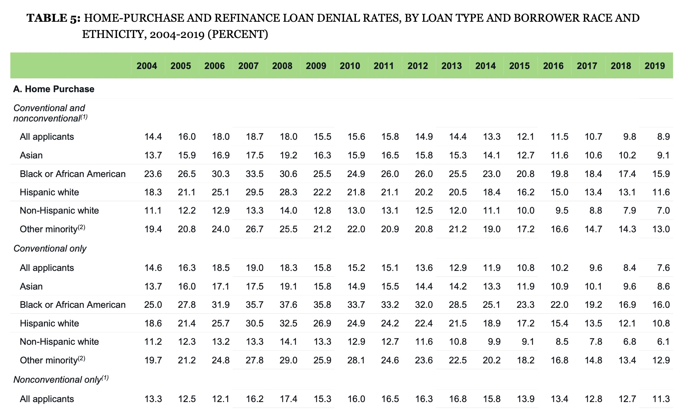

```{r setup, include=FALSE}
# Your libraries go here

library(tidyverse)
library(ggplot2)
library(knitr)
library(kableExtra)

library(caret)    # Model Framework
library(skimr)    # Used for EDA
library(klaR)     # Implemented KNN and Naive Bayes models, etc
library(class)    # used for KNN classifier

# PLEASE ADD YOUR R LIBRARIES BELOW
# ------------------------------
library(tidymodels)
library(VSURF) 
library(dplyr)
library(mice)

library(vip)
library(reshape2) # PT
library(data.table) # PT
library(xgboost)


# ---------------------------------
knitr::opts_chunk$set(echo = FALSE, message=FALSE, warning=FALSE)

```

```{r control-slow-code}
# Alex:
# This code chunk is only to be used for conditionally disabling certain
# very slow model code as I merge different sections and need to frequent recompile
runSlowChunks = T

```


# Introduction {-}

This document discusses analyses of two datasets, the Palmer Penguin dataset and a Loan Approvals dataset prepared by Group 6.  We divide the document into five parts and adopted two key principles to undertaking this analysis:  

First, group has developed a system of checks and balances in preparing each model's output.  A primary and secondary author cross validate each model (pun intended) by  independently coding and reconciling outputs.  Two co-authors also bring a wider perspective on discussion and diagnostics.   Afterwards, the primary author drafts the text for inclusion in this document.  

Second, because four of the five sections deal with the Loan Approvals data, we decided to adopt a common dataset for all model analyses.  Data wrangling and preparation are done once only. Consistency of the data in the last four parts is essential to assess model performance.

**Section 1** analyzes the Palmer Penguin dataset using the KNN model to predict `species`.  The authors are Alexander Ng (primary) and Randy Thompson (secondary).  

**Section 2** conducts an exploratory data analysis and defining the common data set for modeling.  The authors are Randy Thompson (primary) with contributions by all other members.

**Section 3** analyzes the Loan Approvals by Decision Tree.   The authors are Randy Thompson (primary) and Philip Tanofsky (secondary).  We have linked to that work rather than include it directly in this document.

**Section 4** analyzes the same Loan Approvals with a Random Forest model.  The authors are Scott Reed (primary) and Alexander Ng (secondary). 

**Section 5** analyzes the same Loan Approvals with a Gradient Boosting approach.  The authors are Philip Tanofsky (primary) and Scott Reed (secondary).  

**Section 6** concludes with a discussion of the model performance and an appraisal of the merits of each result.  We also consider the role of model driven prediction in a loan approvals business context.

**Section 7** presents our `R` code and technical appendices and references.

# Penguins and the KNN algorithm

Following the data cleaning approach taken in prior assignments, we exclude observations where the feature `sex` is undefined.
We also exclude the two variables `island` and `year` which do not seem helpful in prediction analysis.  We follow the variable selection process described in a prior assignment [here](https://rpubs.com/Fixed_Point/728197).

This still gives a substantial subset $333$ out of $344$ original observations.
The below table illustrates sample rows of the cleansed dataset used in the subsequent KNN analysis.


```{r cleaned-subset}
library(palmerpenguins)

# The final dataset excludes observations with missing sex and drops the island and year variables.
pc = penguins %>% filter( is.na(sex) == FALSE) %>% dplyr::select( -one_of("island", "year") )

head(pc) %>% kable(caption="Scrubbed penguin data set") %>% kable_styling(bootstrap_options = c("striped", "hover"))

```

We obtain `r nrow(pc)` rows of observations with 6 columns of explanatory and response variables.

## Data Transformation for KNN

The next step is to normalize the data so that each quantitative variables have a mean zero and standard deviation equal to 1.
However, we need to also include the `sex` variable in the K-nearest neighbor model.   Normalization ensures that each variable has equal influence on the nearest neighbor calculation.   Otherwise, a quantitative variable whose scale is much larger than the other variables would dominate the Euclidean distance calculation used in the KNN model.

However, we also need to include the `sex` variable as a feature in the KNN model.  Categorical variables pose a challenge in the KNN context because they need to be mapped to a numerical equivalent.  In the case of this data set, two facts are key:

a) the original data set gathered penguins by breeding pairs - thus the number of males and females is very balanced.
b) the variable is binary.  Thus, two equal and opposite values can accomplish the goal of normalization.

For these reasons, we do not normalize `sex` but use the mapping function $f$ defined as:

$$\begin{equation}
f(\text{sex}) = 
   \begin{cases}
    1 & \text{sex} = \text{male} \\
    -1 & \text{sex} = \text{female} \\
   \end{cases}
\end{equation}
$$
Because the data set is gender balanced, $E[f(\text{sex})] \approx 0$ and $Stdev(f(\text{sex})) \approx 1$.
Hence, $f(\text{sex})$ is nearly normalized.  With these transformations, the KNN dataset is prepared for model evaluation.
We illustrate the top 5 rows of the training data set below.  Note that the sampled indices are displayed in the left most column as row values in the resulting dataframe.

```{r knn-split-data}

set.seed(10)

#  Construct the standardized dataset with the response variable, the 4 quantitative variables normalized 
#  with the scale function and the sex variable normalized with the 1,-1 assignment explained previously.
#
standardized = cbind( pc[,1], scale( pc[, 2:5] ) , sex = data.table::fifelse(pc$sex == 'male' , 1 , -1) )

# Define an 80-20 split of the training and test data.
# -------------------------------------------------------------------------------------
training.individuals = createDataPartition(standardized$species, p= 0.8 , list = FALSE)

# X variables include bill_length_mm, bill_depth_mm, flipper_length_mm, body_mass_g,  sex (converted to -1,1)
# Y variable is just the species class
# train data is the standardized subset of the full data set
# test data is the complement of the training data set.
# -----------------------------------------------------------------
train.X  =  standardized[ training.individuals,  2:6]
test.X   =  standardized[-training.individuals,  2:6]
train.Y  =  standardized[ training.individuals,    1]
test.Y   =  standardized[-training.individuals,    1]

head(train.X ) %>% kable(caption="Normalized Training Data - 1st Few Rows", digits = 2 ) %>% 
  kable_styling(bootstrap_options = c("striped", "hover") )
```


## Cross Validation and Parameter Tuning with KNN

We will use `caret` to test a range of possible values of $k$ and select the optimal $k$ based on minimizing the cross validation error.   We did the pre-processing previously using `scale` so there is no need to invoke further data transformation inside `caret` pre-processing function calls.

`trainControl` allows us to define the training parameters.

`tuneLength` decides the range of allowed $k$ value to compute against the model.

We choose a 5-fold cross validation method to ensure the test set is sufficiently large.

```{r knn-model-plot}
model = train( species ~. , data = standardized , method = "knn" ,
         trControl = trainControl("cv", number = 5 ), tuneLength = 10 )

# Plot the model output vs. varying k values.
plot(model)
```

Using the above model plot which shows the average cross validation accuracy at each parameter $k$ used in the KNN model, we see that the best kappa and accuracy occur at $k=5$ nearest neighbors.  This is evident when we display the (cross validation) model output below.

```{r knn-model-result}
model

# The best tuning parameter k that 
# optimized model accuracy is:
#model$bestTune
```

## KNN Model Output and Performance

To assess model performance and investigate the suitability of our choice of $k=5$, we consider two approaches.
First we examine the statistical output of the confusion matrix.   The accuracy and kappa ought to look attractive in the model selection.   Second, we examine the smoothness of the decision boundary by plotting the decision boundary for $k=1$ and $k=5$.
If the optimal $k$ shows a relatively smooth boundary, this is supporting evidence that the model parameters are reasonable.

First, we construct the confusion matrix of one specific implementation of the KNN model for the train-test split following the same proportions as the cross-validation study.  We specifically use the `caret` interface rather than the simpler `class` interface to ensure consistency across multiple models in future.


```{r knn-predmulti}

# Simpler interface using the knn function within class.
knn.pred5 = knn(train.X, test.X, train.Y , k = 5, prob = FALSE) 
cm5 = confusionMatrix(knn.pred5, test.Y) 

```

```{r knn-train}

# This model approach uses tuneGrid with a single value to calculate kNN 
# only at a single number of nearest neighbors.
# ------------------------------------------------------------------------------
x2 = train( species ~ . , data = standardized[training.individuals,] , 
            method = "knn", 
            trControl = trainControl(method="none"), 
            tuneGrid=data.frame(k=5) )

pred2 = predict(x2, newdata=test.X)

(cmknn2=confusionMatrix(pred2, test.Y))
```


We see in the confusion matrix output above that accuracy is 98.46% and kappa is 97.6%.  These are consistent with the cross validation results.   We conclude that KNN is a very effective classifier for penguin gender.  Only 1 penguin in 65 was misclassified:  a Chinstrap was predicted to be an Adelie penguin.


```{r build-decision-grid}

# We visualize a projection of the decision boundary flattened to 2 dimensions to illustrate
# the smoothness of the KNN boundary at different values of k.
# First, choose the variables, then build a sampling grid.
# ------------------------------------------------------------------------
pl = seq(min(standardized$bill_length_mm), max(standardized$bill_length_mm), by = 0.05)
pw = seq(min(standardized$bill_depth_mm), max(standardized$bill_depth_mm), by = 0.05 )

# The sampling grid needs explicit values to be plugged in for the variables
# which are not the two projected variables.  Since variables are standardized to
# mean 0 and variance 1, we choose zero for flipper_length and body_mass because they are continuous 
# and the mean and mode are close.
# However, for sex, we choose male because the average sex = 0 is not the mode.
# In practice, sex = 0 gives weird decision boundaries in the projected plot.
# ------------------------------------------------------------------------------
lgrid = expand.grid(bill_length_mm=pl , bill_depth_mm = pw , flipper_length_mm = 0, body_mass_g = 0 , sex = 1 )

knnPredGrid = predict(x2, newdata=lgrid )

num_knnPredGrid = as.numeric(knnPredGrid)

num_pred2 = as.numeric(pred2)

test = cbind(test.X, test.Y)
test$Pred = num_pred2
```

Next, we visualize the decision boundary of our KNN model to check for model suitability.  Custom code needs to be written as we are not aware if this plot type is currently provided by any R package.

Adapting the R recipe for KNN decision boundary plots found in the stackoverflow page [here](https://stackoverflow.com/questions/32449280/how-to-create-a-decision-boundary-graph-for-knn-models-in-the-caret-package)
we see below that the decision boundary for $k=5$ nearest neighbor algorithm is reasonably smooth and not overfitted to the data.

```{r knn-5-decision-boundary}
ggplot(data=lgrid) + stat_contour(aes(x=bill_length_mm, y= bill_depth_mm, z = num_knnPredGrid), bins = 2 ) +
  geom_point( aes(x=bill_length_mm, y= bill_depth_mm, color = knnPredGrid),  size = 1, shape = 19, alpha = 0.2) +
  geom_point( data= test , aes(x=bill_length_mm, y=bill_depth_mm, color=pred2 ) , size = 4, alpha = 0.8, shape =24 ) +
  ggtitle("KNN Decision Boundary for Penguins Data with k=5 neighbor")

```

However, the same KNN decision boundary for $k=1$ shows a much more twisted curve.
The border between the Chinstrap and Adelie regions in the upper middle half shows a zig-zag pattern characteristic of overfitting.  So we reject the choice of $k=1$ as the model even though both  $k=5$ and $k=1$ KNN models have **identical** confusion matrices.  ( The $k=1$ confusion matrix is omitted for brevity. )  This means model selection requires considering factors not captured by the confusion matrix.


```{r knn-1-decision-boundary}

# This model approach uses tuneGrid with a single value to calculate kNN 
# only at a single number of nearest neighbors.
# ------------------------------------------------------------------------------
x3 = train( species ~ . , data = standardized[training.individuals,] , 
            method = "knn", 
            trControl = trainControl(method="none"), 
            tuneGrid=data.frame(k=1) )  # Now we use a k=1 nearest neighbor algorithm which is overfitted.

pred3 = predict(x3, newdata=test.X)


knnPredGrid3 = predict(x3, newdata=lgrid )

num_knnPredGrid3 = as.numeric(knnPredGrid3)

num_pred3 = as.numeric(pred3)

test = cbind(test.X, test.Y)
test$Pred = num_pred3

ggplot(data=lgrid) + stat_contour(aes(x=bill_length_mm, y= bill_depth_mm, z = num_knnPredGrid3), bins = 2 ) +
  geom_point( aes(x=bill_length_mm, y= bill_depth_mm, color = knnPredGrid3),  size = 1, shape = 19, alpha = 0.2) +
  geom_point( data= test , aes(x=bill_length_mm, y=bill_depth_mm, color=pred3 ) , size = 4, alpha = 0.8, shape =24 ) +
  ggtitle("KNN Decision Boundary for Penguins Data with k=1 neighbor")
```


# Loan Approvals:  Exploratory Data Analysis


##  Assessing the Raw Data

Our EDA shows the raw loan approvals dataset has varying level of quality.

Complete variables include:  `Loan_ID`,  `Education`, `Property_Area`, `Loan_Status`, `ApplicantIncome`,  `CoapplicantIncome`
Mostly complete variables include:  `Married`, `Dependents`, `Loan_Amount_Term`, `Gender`

Variables with significant gaps include:   `Self_Employed`,  `LoanAmount`, `Credit_History`
Of these variables, `Credit_History` is the most problematic and it influences the Loan Approval decision.


## Defining a Common Dataset for Loan Approvals

In this section, we construct a common loan approval data which will be used for all of the model studies that follow.  There are several steps that we take:

1. It consists solely of the records with no missing values for any relevant column and then exclude useless variables.   We call this subset of observations.  This reduces the number of observations from 614 to 480 which is a 78.2% of the original data set.
While this is a significant reduction in the number of observations the remaining data is still sufficient for fitting models.

2. Next, we omit one irrelevant column:  the `Loan_ID`.  An identifier which is exogenous to the loan applicant and is assumed to be related solely to computer system processes.

3. Then we add a synthetic variable `Total_Income` which represents the sum of the `ApplicantIncome` and `CoapplicantIncome`.

4. We scale all quantitative variables to mean 0 and variance 1 variables with the `scale` function and retain both the nominal and scaled versions.   The scaled variables are named like their nominal counterparts but prefixed with a lower case `s`.  For example, `sApplicantIncome` has mean 0 and variance 1 whereas `ApplicantIncome` has the monthly nominal income.

5. Further, we convert the character type data columns from *text* to *factor*.  This is importance for `Loan_Status` but also relevant for others like:  `Credit_History`, `Property_Area`, `Gender`, `Married`, `Education`, `Self_Employed`.  In addition, we convert `Dependents` from text to an ordered factor because the number of children is ordered.

Lastly, the common data set is exported to flat file.  Each group member performs their Loan Approval model study by loading the common data set and making subsequent selections or transformations while retaining the same observations.


```{r build-common-dataset, eval=T, fig.width=10}
# This code chunk should only be run to build the common data set.  
# Any model builder should rely on importing the common data set only.
# Thus, set eval=TRUE when generating a new version of the common data set.
# Otherwise, set eval=FALSE to skip this step.
# ------------------------------------------------------------------------

# This code block assumes the raw Loan Approval data file in csv form has been placed in the same folder as this script.
# ----------------------------------------------------------------------------------------
cla <- read_csv("Loan_approval.csv") %>% dplyr::select(-Loan_ID)  # drop the row identifier.

# Add a column for Total Income of Applicant and Co-Applicant
# ---------------------------------------------------------------------------
cla$Total_Income = cla$ApplicantIncome + cla$CoapplicantIncome

```

Next, we explore missing data.  Below, we see that we have some missing variables including a substantial run on Credit History. As this is likely to be a very important variable, has only two output states, and is not obviously derivable from the features provided, it is not a great candidate for imputation. 


```{r explore-missing-data}
a = mice::md.pattern(cla, rotate.names = T)
```

```{r}

# We build a dataset in which all observations have fully populated values.
# ---------------------------------------------------------------------------
cla = na.omit(cla)

# Add mean zero and variance 1 versions of quantitative variables.
# ----------------------------------------------------------
cla %>% mutate( sApplicantIncome = scale(ApplicantIncome), 
                sCoapplicantIncome = scale(CoapplicantIncome),
                sTotal_Income = scale(Total_Income) ,
                sLoanAmount   = scale( LoanAmount)
                ) -> cla

head(cla)

write_csv(cla, "cla.csv") # Write the scaled common loan approvals data set to local disk.  

```


After exporting the common loan approval data, we load it into the R session 
and transform character string data to factors.  This allows some R models to better handle response variables.


```{r load-common-data, eval=T}
cla = read_csv("cla.csv")

# Transform the character data columns into factors
# --------------------------------------------------------
cla$Loan_Amount_Term = factor(cla$Loan_Amount_Term)
cla$Loan_Status = factor(cla$Loan_Status)  # Convert the response to factor
cla$Credit_History = factor(cla$Credit_History)
cla$Property_Area = factor( cla$Property_Area)
cla$Gender = factor( cla$Gender)
cla$Married = factor(cla$Married)
cla$Dependents = ordered(cla$Dependents, levels = c("0" , "1", "2" , "3+") )
cla$Education = factor(cla$Education)
cla$Self_Employed = factor( cla$Self_Employed)

```

When performing modeling of common data set, each member may omit one of the Income variables to avoid multi-collinearity problems involving:  `ApplicantIncome`, `CoapplicantIncome` and `Total_Income` or their scaled equivalents.

## Exploring Correlations


Five of our independent variables have only two levels as displayed in n_unique. For our dependent variable, Loan_Status, we have twice the number of yes's than no's. We could downsample to have an even split of yes/no but with only, 480 rows left, we decided we didn't want to lose any more data. The four numeric variables have been duplicated then centered to a mean of 0 and scaled to a standard deviation of 1. 

```{r}
ncla <- cla[,1:13]
```


Next we explore the pairwise correlation of numeric and factor variable separately.

```{r}
GGally::ggpairs(ncla, mapping = "Loan_Status", columns = c(6:8, 13, 12)) %>% print()
```
The pairwise correlation plot shows statistical significants with three asterisks next to the correlation value. As expected, Total Income is highly correlated with applicant and coapplicant incomes since Total income is a sum of the two. More importatntly, Loan Amount is moderately positively correlated with Applicant Income and weakly positively correlated with Coapplicant Income. Overall, there doesn't appear to be a large difference in distribution among numeric variables between a loan being approved or not.

```{r}
GGally::ggpairs(ncla, mapping = "Loan_Status", columns = c(1:5, 10:12), ) %>% print()
```

For pairwise factor bar charts, you're looking for large mismatches in box size within the upper triangle of the matrix. For example: number of dependents vs married. The top row of boxes look fairly even meaning married people have a fairly even distribution of number of dependents. However, non-married people have a high level of 0 dependents and not very many 1's, 2's, or 3+'s. Our variable of interest Loan_status has a large mismatch on Credit_history. There appears to be an even amount of people who have and don't have credit history when the loan status is not approved but almost no one has a loan status approved without also haveing a credit history of yes. This is quantified in our earlier analysis. This large variance should make credit history a good predictor variable.


## Conditional Approval Rates by Categorical Variable

One simple type of exploratory data analysis is to 
examine the conditional approval rates by values of each categorical variable $C$.  
For example, there are  three subcategories (__Urban__, __Suburban__, __Rural__) of the variable `Property_Area`.  
If we find significant differences in the conditional loan approval rates between __Urban__ and __Rural__ applications,
this suggests that `Property_Area` may help to predict approvals.

The conditional approval rates for each categorical variable is displayed below.

```{r approval-rate, results='asis'}

#  Display the approval rate statistics for each qualitative field
#  in absolute count and percentage terms by category.
# 
display_approval_rate <- function(la , field )
{
    a = la[, "Loan_Status"]
    b = la[, field]
    
    c = table(cbind(a,b))  # Count table
    
    pcts = as.data.frame.matrix(c) /nrow(la) * 100   # Percentage equivalent
    col_sums = colSums(pcts)  # Shows the results by the field

    app_rate = pcts[2,]/col_sums   * 100   # Approval rate assumes row 2 is the "Yes" row.

    yy = rbind( pcts, col_sums, app_rate, colSums(c)) 
    rownames(yy)[1]= paste0( rownames(yy)[1], " (%)")
    rownames(yy)[2]= paste0( rownames(yy)[2], " (%)")
    rownames(yy)[3]= paste0( field, " Column Total %:")
    rownames(yy)[4]="Loan Approval Rate by Column%"
    rownames(yy)[5]="Total Applications:"
    print(yy %>% kable(digits = 1, caption = paste0('Loan Approved vs. ', field , ' by Percent') ) %>%
             kable_styling(bootstrap_options = c("striped", "hover") )  %>%
             row_spec(4, background = "skyblue", bold = TRUE) )
}

cat_vars = c("Property_Area", "Credit_History", "Loan_Amount_Term", "Self_Employed", "Education", "Dependents", "Married", "Gender")

for( field in cat_vars)
{
   display_approval_rate( cla , field)  
   cat("\n")
}

```
We observe large differences in approval rates in the following categorical variables:

1.  `Credit_History`:   Those with credit history have 79.3% approval rate vs. 10.0% for those without.

2.  `Property_Area`:   `Rural` approval rates 61.2% are lower than `Semiurban` at 78.0%

3.  `Married`:   Unmarried applicant approval rate 62.1% is lower than for married at 73.0%

4.  `Education`:  `Not Graduate` approval rates 62.9% are lower than `Graduate` at 70.8%

5.  `Gender`:   Female applicant approval rate 62.8% is lower than for males at 70.6%.

These differences should suggest the most significant categorical variables for prediction purposes.

# Loan Approvals: Decision Trees

We had to include the decision tree analysis as a separate HTML link to avoid code interaction.  
Apparently, code from this module interacted with model output from other areas so we had to run it in isolation.
Possible issues are variable name collision or changing of package default settings in `tidymodels`.

## Model Analysis 

**PLEASE SEE THE LINK BELOW FOR WORK.**

The RMarkdown page produced in concert with the main submission is below: (RMD page)[https://rpubs.com/Fixed_Point/751997]


# Loan Approvals: Random Forest Models


## Feature Selection

We first run an all variables (save the index variable Loan_ID, and the constituent parts of scaled or combined variables) in a random forest to use it as a variable selection sieve. We use VSURF as it was the best performing in Speiser (2019). 

VSURF for the uninitiated is a multi step variable selection process that first ranks variables by importance.  It then excludes features that have a null importance. VSURF generates both a selection of features for  for interpretation  by adding variables sequentially and generating random forests while minimizing OOB error, and a selection for  prediction which similarly sequentially adds variables but instead of blindly limiting OOB it penalizes adding variables that add noise. 

```{r, eval=runSlowChunks, echo=FALSE,results='hide', message=FALSE, warning=FALSE,fig.show='hide' }
set.seed(10)
data_split <- initial_split(cla, prop = .8)
train_data <- training(data_split)
test_data  <- testing(data_split)
use_data <- train_data %>%dplyr::select( -ApplicantIncome, -CoapplicantIncome, -Total_Income, -sApplicantIncome, -sCoapplicantIncome, -LoanAmount)
surfedModel <- invisible(VSURF::VSURF(use_data%>%dplyr::select(-Loan_Status), use_data$Loan_Status, parallel=F))
```
```{r, eval=runSlowChunks, echo=F}
vsurfStages <- tibble('Stage' = "Prediction" , 'Fields' =colnames(use_data%>%dplyr::select(-Loan_Status))[surfedModel$varselect.pred])
vsurfStages <-vsurfStages %>% add_row('Stage' = 'interpretation' , 'Fields'=paste(colnames(use_data%>%dplyr::select(-Loan_Status))[surfedModel$varselect.interp], collapse=", "))
vsurfStages <-vsurfStages %>% add_row('Stage' = 'Ranked Importance' , 'Fields'=paste(colnames(use_data%>%dplyr::select(-Loan_Status))[surfedModel$varselect.thres], collapse = ", "))
vsurfStages

```
VSURF selects a single variable "model" for predictive use. This suggests that a very parsimonious model indeed might be sufficient. 


```{r fig.cap="'Model' Using only Credit History" , eval=runSlowChunks }
loans_testing <- na.omit(testing(data_split))
loans_testing["factorCreditHistory"] <- as.factor(as.logical((loans_testing)$Credit_History==1))
loans_testing["factorLoanStatus"] <- as.factor((loans_testing)$Loan_Status=="Y")
loans_testing %>% metrics(truth = factorLoanStatus, estimate = factorCreditHistory)
```
Using this as a "model" we get an accuracy of 83.1% and a Kappa of 0.486. Cohen (1960) would suggest that as an agreement unlikely to be caused by chance (which is important as a model that simply flagged every loan as a success would have an accuracy of .737 but a Kappa of course of 0)


## Model building


If we were to ignore VSURF's suggestion we can try to sweep through the ranked recommended features (which are reported in order from most promising to least)

```{r rf-model-building, eval=runSlowChunks}
loan_testing <- na.omit(testing(data_split))
loan_testing["factorCreditHistory"] <- as.factor(as.logical((loan_testing)$Credit_History==1))
loan_testing["factorLoanStatus"] <- as.factor((loan_testing)$Loan_Status=="Y")
actual_result <- loan_testing %>% metrics(truth = factorLoanStatus, estimate = factorCreditHistory)
ourAccuracy <- tibble('Variables' = 1 , 'Kappa' =actual_result$.estimate[2], 'Accuracy' = actual_result$.estimate[1])
ourAccuracy <- ourAccuracy[-c(1),]
#loan_testing <- testing(data_split) #reset with nas added back in
for(var in 1:length(surfedModel$varselect.thres)){
  loans_rf_rec <-  recipe(Loan_Status~., data = train_data)  %>%
    step_rm(everything(),-all_of(colnames(use_data[(surfedModel$varselect.thres)[1:var]])), -Loan_Status)  %>%
    #step_knnimpute(all_predictors()) %>%
    step_dummy(all_nominal(), -all_outcomes()) %>% 
    prep()
  loan_training<-juice(loans_rf_rec)
  loan_ranger <- rand_forest( mode = "classification") %>%   set_engine("ranger") %>%     fit(Loan_Status ~ ., data = loan_training)
  loan_testing <- loans_rf_rec  %>% bake(testing(data_split)) 
  actual_result <- loan_ranger %>% predict(loan_testing) %>%     bind_cols(loan_testing) %>%     metrics(truth = Loan_Status, estimate = .pred_class)
  ourAccuracy <- ourAccuracy %>% add_row('Variables' = var , 'Kappa' =actual_result$.estimate[2], 'Accuracy' = actual_result$.estimate[1])
}
ourAccuracy %>% ggplot(aes(x=Variables,y=Accuracy)) + ggtitle("Accuracy as variables are added") +geom_point(color="red") + ylim(0,1) + scale_color_viridis_d(option = "plasma", begin = .9, end=0)
ourAccuracy %>% ggplot(aes(x=Variables,y=Kappa)) +ggtitle("Kappa as Variables are added") +geom_point(color="blue") + ylim(0,.6) + scale_color_viridis_d(option = "plasma", begin = .9, end=0)
ourAccuracy
```

Perhaps unsurprisingly (as this is broadly similar to what VSURF does internally) we don't seem to receive any benefit of adding additional variable candidates, indeed the model actually performs somewhat worse for many options.

Still if we use the features for interpretation VSURF has selected and a wide parameter grid for the tunable parameters mtry and number of trees  we can attempt to tune a model.

```{r, eval=runSlowChunks, warning=F}
our_data<-use_data[,colnames(use_data[(surfedModel$varselect.thres)])]
our_data$Loan_Status<-use_data$Loan_Status
loans_rf_rec <-  recipe(Loan_Status~., data = our_data)  %>%
  prep()
loans_grid<-grid_regular(trees(), finalize(mtry(), use_data), levels=5)
loan_training<-juice(loans_rf_rec)
loan_ranger <- workflow()%>% add_recipe(loans_rf_rec) %>% add_model(rand_forest(mtry=tune::tune(), trees = tune::tune(), mode = "classification") %>% set_engine("ranger",importance = "impurity"))
folds <- vfold_cv(our_data)
class_metrics <- metric_set( kap, accuracy)
tree_res  <- loan_ranger %>% tune_grid(resamples = folds, grid=loans_grid, metrics=class_metrics)
loans_best <-  tree_res %>% select_best("kap")
final_loans_wf <-loan_ranger %>% finalize_workflow(loans_best)
final_loans_fit <-final_loans_wf %>% fit(data = our_data) 
testing_data<- (testing(data_split)) 
our_data<-testing_data[,colnames(use_data[(surfedModel$varselect.thres)])]
our_data$Loan_Status<-testing_data$Loan_Status
loan_testing <- loans_rf_rec %>% bake(our_data)
actual_result<-final_loans_fit %>% predict(loan_testing) %>%     bind_cols(loan_testing) %>%     metrics(truth = Loan_Status, estimate = .pred_class)
tree_res %>%
    collect_metrics() %>% mutate(trees = factor(trees)) %>% ggplot(aes(mtry, mean, color=trees)) +
    geom_line(size = 1.5, alpha = 0.6) +
    geom_point(size = 2) +
    facet_wrap(~ .metric, scales = "free", nrow = 2) +
    scale_color_viridis_d(option = "plasma", begin = .9, end=0)
final_loans_fit %>%      pull_workflow_fit() %>%      vip()
kable(loans_best)
kable(actual_result)
```
Looking at breakdowns of performance we see the best performance using Kappa to be mtry of 3 and trees of 1500 This does not appear to be a particular effective tuning and many others perform similarly. Unfortunately this doesn't reflect much in the way of actual model improvement. 


Our full model has an accuracy and kappa as presented above.  Unfortunately, this is less than our "Model" of a simple credit_history. 
```{r eval=runSlowChunks}
rfbound<-final_loans_fit %>% predict(loan_testing) %>%     bind_cols(loan_testing)
caret::confusionMatrix( rfbound$.pred_class , rfbound$Loan_Status )  # changed the order of arguments:  prediction goes first.

```

We examine the confusion matrix and see the raw accuracy is .7790


# Loan Approvals:  Gradient Boosting

Gradient Boosting model approach is an ensemble method that applies repeated models to resampled data and pooling estimates. A boosted tree fits the next tree to the residuals of the prior tree. The residual error is minimized through each successive tree and typically accomplished through shallow trees. The gradient boosting approach uses the XGBoost algorithm which stands for extreme gradient boosting.

## Feature selection

An initial attempt of the XGBoost model with all of the feature variables proved quite underwhelming with an accuracy of 0.75 and kappa of just 0.272. The importance chart showed $Credit\_History$ as clearly the most important (greater than 75%), then $ApplicantIncome$, followed by $Total\_Income$, and the $LoanAmount$. The dummy variable $Property\_Area\_Semiurban$ also made the list of important variables. In an effort to simply the model and also construct a definite relationship between the income and the loan amount, a derived variable $Income\_To\_LoanAmt$ is calculated as the ratio of the total income to the requested loan amount. The derived variable proved beneficial to increasing the model accuracy.

Based on the importance factor of the features from the initial baseline model along with the success of the derived variable, the following variables are selected as input into the gradient boosting model.

- Credit_History: the most important feature 

- Income_To_LoanAmt: derived feature based on the combined income of the applicant and co-applicant to the requested loan amount

- Property_Area: valuable feature for semiurban and urban

The data is split using 80% for training and 20% for test. Initial model attempts with the 80/20 split caused underfitting as the model predicted $Loan\_Status$ as Yes for every instance. By decreasing the count of trees and lowering the number of cross-validation folds, the gradient boosting model began to perform better.

```{r warning=F,message=F}
# https://bcullen.rbind.io/post/2020-06-02-tidymodels-decision-tree-learning-in-r/
# Section Boosted Trees

# Tune usage from: https://www.r-bloggers.com/2020/05/tidymodels-and-xgbooost-a-few-learnings/

# Data splitting
set.seed(1234)

lap_data <- cla
lap_data$Income_To_LoanAmt <- lap_data$Total_Income / lap_data$LoanAmount

lap_data <- dplyr::select(lap_data, Credit_History, Income_To_LoanAmt, Property_Area, Loan_Status)

summary(lap_data)

lap_data_split <- initial_split(lap_data, prop=0.8, strata=Loan_Status)

lap_training <- lap_data_split %>% training()

lap_test <- lap_data_split %>% testing()

lap_folds <- vfold_cv(lap_training, v=5, repeats=1)
```


## Model definition

The XGBoost model engine creates the gradient boosting model. The tree input parameter is set to 25 based on trial and error. Sample runs above 30 did not improve accuracy. With only five cross-validation folds generated, each with 10 combinations of the parameters, 50 unique XGBoost models are generated that each build 25 trees. The low number of variables does not require a great number of cross-validation folds, parameter combinations, or tree count in order to produce a high accuracy.

For generating the combinations of parameters, the tune() method allows the parameters to be determined by a tune grid to identify the best performing parameter definitions.

```{r warning=F,message=F}
# Specify the model
mod_boost <- boost_tree(trees = 25,
                        learn_rate = tune(),
                        sample_size = tune(),
                        mtry = tune(),
                        min_n = tune(),
                        tree_depth = tune()) %>%
  set_engine("xgboost", lambda=0, alpha=1, num_class=3, verbose=0) %>%
  set_mode("classification")

```
The parameters are defined by the sampling size and then the parameter grid is built by the function grid_max_entropy(). The size of 10 was selected based on trial and error. Values above 10 did not provide improved model accuracy. As mentioned above, the 10 combinations of parameters for each of the 5 folds produces 50 unqiue models. The few number of variables does not require a high number of model variations to produce a high accuracy.

```{r warning=F,message=F}
boost_params <- parameters(
  min_n(),
  tree_depth(),
  learn_rate(),
  finalize(mtry(), dplyr::select(lap_training,-Loan_Status)),
  sample_size = sample_prop(c(0.4,0.9))
)

boost_grid <- grid_max_entropy(boost_params, size=10)
```
In order to properly run the tidymodels approach to model creation, a recipe is defined for the training data. For the numeric input variables, the data is transformed per the Yeo-Johnson transformation which is similar to the Box-Cox transformation. The numeric data is also normalized. The nominal data is transformed by creating dummy variables within the recipe. The Yeo-Johnson transformation ensures a near-normal shape to the $Income\_To\_LoanAmt$ variable, otherwise the model accuracy suffered greatly without the transformation.

```{r warning=F,message=F}
# Feature Engineering

lap_recipe <- recipe(Loan_Status ~ ., data = lap_training) %>%
  step_YeoJohnson(all_numeric(), -all_outcomes()) %>%
  step_normalize(all_numeric(), -all_outcomes()) %>%
  step_dummy(all_nominal(), -all_outcomes())

lap_recipe %>%
  prep() %>%
  bake(new_data = lap_training) %>% glimpse()
```

```{r warning=F,message=F}
# Create workflow
boost_workflow <- workflow() %>%
  add_recipe(lap_recipe) %>%
  add_model(mod_boost)
```

The tune_grid() method computes the evaluation metrics based on the parameters of the model. The results with the highest Kappa value are displayed. The log-loss metric is the default evaluation metric of the XGBoost algorithm. The tune_grid() produces the 50 unique XGBoost models to be considered.

```{r warning=F,message=F}

class_metrics <- metric_set(accuracy, kap, recall, precision, f_meas, roc_auc, sens, spec)

boost_tuning <- tune_grid(
  object = boost_workflow,
  resamples = lap_folds,
  grid = boost_grid,
  metrics=class_metrics,
  control = control_grid(verbose = TRUE)
)

boost_tuning %>% show_best(metric = 'kap')
```

The five parameters - mtry, min_n, tree_depth, learn_rate, and sample_size - are plotted against the mean log-loss value, the default XGBoost evaluation metric. The mtry plot shows a range of 1 to 3, with most results on 2. The min_n plot shows a range just above zero to over 30. The tree depth plot shows a range just above zero to over 10, as 14 appears as the most common value. The learn rate plot shows the lower learn rates to be most common. The sample size plot follows the defined range from 0.4 to 0.9 with slightly higher volume at the range's higher end. 


```{r warning=F,message=F}
boost_tuning %>% collect_metrics() %>% 
  dplyr::select(mean,mtry:sample_size) %>% data.table %>% 
  melt(id="mean") %>% 
  ggplot(aes(y=mean,x=value,colour=variable)) + 
  geom_point(show.legend = FALSE) + 
  facet_wrap(variable~. , scales="free") + theme_bw() +
  labs(y="Mean log-loss", x = "Parameter")
```

Based on the highest Kappa value, the best gradient boosting model is selected. The best model as shown below contains the following parameter values.

- mtry 2: Number of predictors randomly sampled at each split when creating the tree models. With only three variables, two is sufficient.

- min_n 3: Minimum number of data points in a node before the node is split further. The value of three does seem low considering the number of instances.

- tree_depth 14: Maximum depth of the tree. With three variables, this tree depth is likely higher than needed.

- learn_rate 1.484305e-07: Rate at which the algorithm adapts for each iteration. The lower the learn rate the better.

- sample_size 0.8813854: Amount of data used in the fitting step. With a defined range of 0.4 to 0.9, the result indicates a larger percentage of the data used in the fitting routine.

```{r warning=F,message=F}
# Select best model based on kap
best_boost <- boost_tuning %>%
  select_best(metric = 'kap')

# view the best tree parameters
best_boost

```

## Model performance

With the best model selected, the workflow is finalized before the model is fit based on the training data and subsequently generating predictions on the test data set.

```{r warning=F,message=F}
# finalize workflow
final_boost_workflow <- boost_workflow %>%
  finalize_workflow(best_boost)
```

```{r warning=F,message=F}
# fit the model
boost_wf_fit <- final_boost_workflow %>%
  fit(data = lap_training)
```

The variable importance plot confirms the primary importance of the $Credit\_History$ variable. Given the few number of input variables, the chart also indicates the $Loan\_To\_LoanAmt$ variable as second important followed by the dummy variables for the property area.

```{r warning=F,message=F}
boost_fit <- boost_wf_fit %>%
  pull_workflow_fit()

vip(boost_fit)
```

The model produces an accuracy of 86.3% and an AUC of 91.5% based on the fit metrics. The ROC-AUC is plotted to confirm the calculated percentage.

```{r warning=F,message=F}
# train and evaluate
boost_last_fit <- final_boost_workflow %>%
  last_fit(lap_data_split)

boost_last_fit %>% collect_metrics()

boost_last_fit %>% collect_predictions() %>%
  roc_curve(truth = Loan_Status, estimate = .pred_N) %>%
  autoplot()
```

The predictions from the gradient boosting model produce a final accuracy of 86.3% and Kappa of 63.9% with the final confusion matrix of the test data predictions.

```{r warning=F,message=F}
boost_predictions <- boost_last_fit %>% collect_predictions()

boost_predictions %>% yardstick::metrics(truth=Loan_Status,estimate=.pred_class)

conf_mat(boost_predictions, truth = Loan_Status, estimate = .pred_class)
``` 

```{r}
(cm_boost_tree = confusionMatrix( boost_predictions$.pred_class, boost_predictions$Loan_Status))
```


# Loan Approvals:  Model Performance and Assessment

In this section, we compare the performance of the decision tree, random forest and gradient boosting models on the Loan Approvals dataset.  

## Model Performance

## Using Prediction in Loans Approvals

We can use Decision Trees, Random Forest, or Gradient Boosting to build a model. The models final performance is as below:

```{r model-report}

model_report = data.frame(  
  model=c("CART Decision Tree", "Random Forest", "Gradient Boost" ),
  software = c("tidymodels", "VSURF", "xgboost") ,
  accuracy = c( 74.7, 81.1,  86.3 ) ,
  kappa = c( 36.2 , 45.5,  63.9) )

kable(model_report, digits = 1 , caption = "Model Performance on Loan Approvals") %>% kable_styling(bootstrap_options = c("striped", "hover") ) %>%
   footnote( general = "All models used the same data with 80-20% split of training to test data from a
             common dataset."
             )

```

We observe that the gradient boost Model has the best performance on both metrics: accuracy and kappa.  There is really no controversy in selecting gradient boost over the other models based on performance alone as it is much better than the next best model - random forest.

But what are other considerations?  If we consider other factors such as run-time, the random forest implementation using VSURF took much longer to tune and run.  VSURF took 3-5 times longer to run than Gradient Boost.  While we did not experiment with parameter tuning to reduce the VSURF run-time, the results nonetheless suggest that gradient boosting may be faster than random forest.

Lastly, the variance importance information from all models is consistent in identifying `Credit_History` has the most importance predictor variable.  It dominates all other variables across all models.

### Future Directions

A key question from this machine learning study is why loan approvals are so strongly dominated by a single explanatory variable:  `Credit_History`.  If this result is true, it suggests that we are asking the wrong question or assuming too much impact from other predictor variables.

Perhaps the question is not just whether a loan is approved, but rather: what is the offered interest rate, loan amount and credit enhancement terms of the resulting covenant.   If the income to loan ratio is low, we expect the bank to demand a risk-adjusted compensation of a higher interest rate.   These decisions are made by the lending institution after making a loan approval decision.

An other omitted variable in this data set is the FICO score which is another key credit metric.  FICO probably has more explanatory power than `Credit_History` and would likewise explain the offered interest rate and loan protection terms.

Lastly, we urge caution in making ANY inferences from this dataset.
The loan approval rate in this data set is atypical of actual industry practice.
As evidence, the following 2019 government [report](https://files.consumerfinance.gov/f/documents/cfpb_2019-mortgage-market-activity-trends_report.pdf)
gives a comprehensive picture of US mortgage approval and denial rates in the country.
Table 5 below shows conventional mortgage denial rates from 2007 to 2019 ranged from a low of 8.9 percent (2019) to a high of 18.7 percent (2007).  

In contrast, our dataset implies a $\color{red}{\text{30.8%}}$  denial rate.  A better understanding of this dataset's provenance and methodology is required before doing more machine learning analysis.




# Appendices

## References


Akin, J. (2020, March 5). Does income affect credit scores? Experian https://www.experian.com/blogs/ask-experian/does-income-affect-credit-scores/. 


Cohen, J. (1960). A coefficient of agreement for nominal scales. Educational and psychological measurement, 20(1), 37-46.

Consumer Finance Protection Bureau, Data Point. (2019) Mortgage Market Activity and Trends
(https://files.consumerfinance.gov/f/documents/cfpb_2019-mortgage-market-activity-trends_report.pdf)

Genuer, R., Poggi, J. M., & Tuleau-Malot, C. (2015). [VSURF: an R package for variable selection using random forests.](https://hal.archives-ouvertes.fr/hal-01251924/document) The R Journal, 7(2), 19-33.


[UC Business Analytics R Programming Guide - Random Forests](https://uc-r.github.io/random_forests)

Speiser, J. L., Miller, M. E., Tooze, J., & Ip, E. (2019). [A comparison of random forest variable selection methods for classification prediction modeling. Expert systems with applications](https://www.ncbi.nlm.nih.gov/pmc/articles/PMC7508310/), 134, 93-101. 


## Code

We summarize all the R code used in this project in this appendix for ease of reading.


```{r ref.label=knitr::all_labels(), echo=T, eval=F}


```


